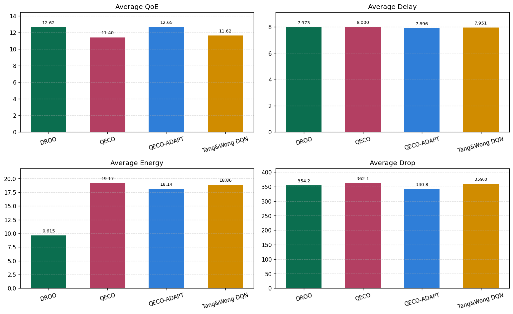
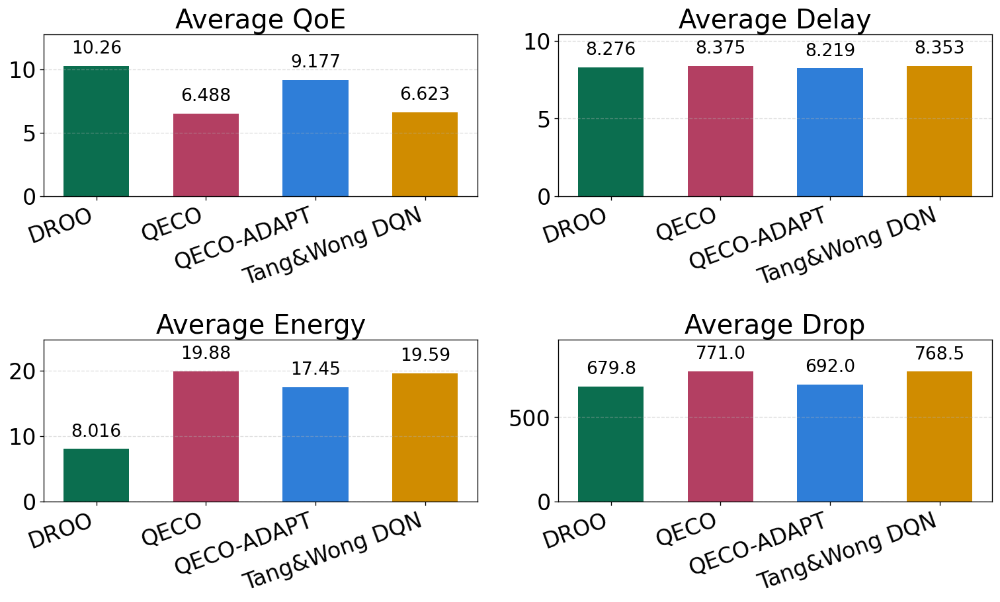
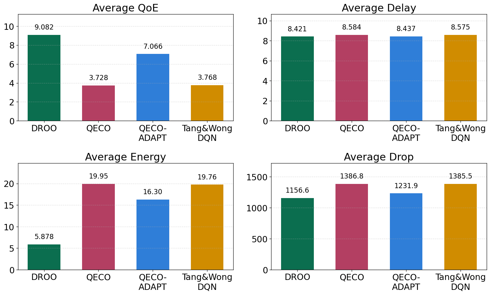

# QECO-ADAPT 분석 본문 구성안

## 1. 서론

모바일 엣지 컴퓨팅(Mobile Edge Computing, MEC) 환경에서 계산 오프로딩은 사용자 단말의 제한된 계산 능력과 배터리 제약을 완화하기 위한 핵심 기술이다[2]. 그러나 사용자가 증가하고 단일 edge node에 작업 요청이 집중되면, edge node의 처리 부하가 커지고 task delay와 deadline violation이 증가하며 일부 task는 dropped될 수 있다[6]. 특히 deadline-sensitive task가 존재하는 MEC 환경에서는 오프로딩 결정이 단순히 에너지 절감만을 목표로 할 수 없으며, 사용자 체감 품질(Quality of Experience, QoE), 지연 시간, 에너지 소비, dropped-task count를 동시에 고려해야 한다.

기존 QECO는 QoE-Oriented Computation Offloading을 목표로 하는 강화학습 기반 오프로딩 알고리즘으로, task completion, delay, energy를 함께 반영해 장기 QoE를 최대화하도록 설계된다[2]. 이러한 QoE 중심 구조는 저부하 또는 일반적인 MEC 조건에서 안정적인 성능을 보이지만, 단일 edge node에 사용자가 집중되는 dense 환경에서는 학습 초반의 불안정성과 높은 부하에 따른 energy pressure가 동시에 나타날 수 있다. 즉 기존 QECO는 후반 안정 정책에서는 강점을 가지지만, 부하가 빠르게 증가하는 환경에서 warm-up 구간의 QoE 손실과 dropped-task 누적을 줄이는 데에는 추가적인 보완이 필요하다.

본 분석은 이러한 문제의식에서 출발하여 QECO-ADAPT의 단일 edge dense 환경 성능을 검토한다. QECO-ADAPT는 기존 QECO의 QoE reward 구조 위에 effective load 기반 energy weight와 offloading gating을 결합한 변형 알고리즘이다. 본 분석의 목적은 QECO-ADAPT가 기존 QECO를 모든 조건에서 대체할 수 있는지 확인하는 것이 아니라, 사용자 밀도가 증가하는 단일 edge 환경에서 QECO의 초반 수렴 손실을 줄이고, 이후 후반 안정 구간에서는 QECO의 성능을 얼마나 잘 따라가는지 확인하는 데 있다.

비교군 중 DROO는 원문에서 wireless powered MEC의 binary online offloading과 계산 시간 절감을 다루는 알고리즘이므로, 본 분석에서는 에너지 효율 및 계산 비용 관점의 baseline 출처로만 사용한다[1]. 즉 본문에서 관찰하는 QoE, Delay, Dropped tasks 비교는 원문 DROO의 평가 지표를 그대로 인용한 것이 아니라, 공통 MEC 평가 환경에서 동일 지표로 다시 측정한 본 실험 결과이다.

## 2. 본론

### 2.1 실험 기준과 평가 방식

QECO 원문은 기본 실험 환경으로 50 mobile devices (MDs)와 5 edge nodes (ENs)를 사용하므로, edge당 평균 사용자 밀도는 10 MDs/EN으로 볼 수 있다[2]. 본 분석에서는 이 값을 기준 밀도 $d_0=10$으로 두고, edge 수를 1로 고정한 상태에서 사용자 수를 10, 30, 50, 80으로 증가시켰다. 따라서 각 조건은 원문 QECO의 edge당 사용자 밀도 대비 1x, 3x, 5x, 8x dense stress condition으로 해석된다. 이 방식은 edge 확장 효과를 제거하고, 단일 edge node가 감당해야 하는 사용자 밀도 증가가 QECO-ADAPT의 성능에 어떤 영향을 미치는지 직접 관찰하기 위한 구성이다.

본 분석에서는 전체 400 episode 평균을 주 비교 기준으로 사용한다. QECO-ADAPT의 핵심 이점은 최종 안정 구간에서의 일방적 우월성이 아니라, 학습 초반부터 QoE 손실과 dropped-task count 누적을 줄이는 수렴성에 있기 때문이다. 따라서 전체 episode 평균은 warm-up 구간에서의 손실까지 포함하는 지표로 사용한다. 반면 final 10% 평균은 후반 안정 구간에서 QECO-ADAPT가 기존 QECO의 성능을 얼마나 잘 따라가는지 확인하는 보조 지표로 해석한다.

평가 지표는 QoE, Delay, Energy, Dropped tasks, Runtime이다. QoE는 높을수록 좋고, Delay, Energy, Dropped tasks, Runtime은 낮을수록 좋다. 여기서 Dropped tasks는 전체 task 대비 drop probability가 아니라, 각 episode에서 deadline 내 완료되지 못한 task count의 평균값이다. 따라서 Dropped tasks의 변화율은 drop rate가 아니라 dropped-task count의 상대적 이득 또는 손실로 해석해야 한다.

### 2.2 QECO-ADAPT의 부하 적응형 제어 구조

QECO-ADAPT는 사용자 수, 시간대별 task arrival profile, 사용자 활동성, edge 수를 이용해 edge 하나가 감당해야 하는 effective load를 추정한다. 이 값은 단순 사용자 수가 아니라, 실제 task 발생 가능성과 edge 자원 수를 함께 반영한 부하 지표이다. 사용자 수가 증가하면 effective load는 증가하고, edge 수가 증가하면 edge당 부하는 감소한다. 본 분석은 edge 수를 1로 고정하므로 사용자 수 증가는 곧 단일 edge dense stress 증가로 연결된다.

부하 적응형 구성식은 다음과 같이 정리할 수 있다. 먼저 사용자 집합을 $\mathcal{U}=\{1,\ldots,N\}$, edge node 집합을 $\mathcal{E}=\{1,\ldots,M\}$으로 둔다. 여기서 $N$은 사용자 수, $M$은 edge node 수이다. 시간대별 기본 task 발생 profile은 $\mathbf{b}=(b_1,\ldots,b_K)$로 정의하며, 사용자별 활동성 계수는 $a_u\in[a_{\min},a_{\max}]$로 둔다. 사용자 $u$가 시간 $t$에 task를 발생시킬 확률은 다음과 같다.

$$
p_{\mathrm{arrive}}(u,t)
=\min\left(1,\max\left(0,b_{\kappa(t)}a_u\right)\right)
$$

여기서 $\kappa(t)$는 시간 $t$가 속한 task arrival profile index이다. 본 분석에서는 평균 task 발생 profile과 평균 사용자 활동성을 이용해 edge 하나가 감당하는 유효 부하를 다음과 같이 정의한다.

$$
\bar{b}=\frac{1}{K}\sum_{k=1}^{K}b_k,\qquad
\bar{a}=\frac{1}{N}\sum_{u=1}^{N}a_u
$$

$$
L_{\mathrm{eff}}=\frac{N\bar{b}\bar{a}}{M}
$$

이때 $L_{\mathrm{eff}}$는 edge 하나에 평균적으로 도착할 것으로 예상되는 task pressure를 의미한다. 즉 사용자 수 $N$이 증가하면 $L_{\mathrm{eff}}$는 커지고, edge 수 $M$이 증가하면 edge당 부하가 나뉘기 때문에 $L_{\mathrm{eff}}$는 작아진다. 본 분석처럼 $M=1$로 고정하면 사용자 수 증가가 곧 effective load 증가로 이어진다.

온라인 multi-user MEC에서 stochastic task arrival, wireless quality, queue backlog를 함께 고려해야 한다는 관점은 HAP-assisted MEC의 dynamic offloading/resource allocation 연구에서도 공통적으로 다뤄진다[5]. 또한 Lyapunov-guided DRL 계열 연구는 time-varying channel과 stochastic task arrival 하에서 long-term queue stability를 명시적으로 고려하므로, dense 조건에서 단순 최종 보상뿐 아니라 안정성 지표를 함께 보아야 한다는 배경 근거가 된다[4].

QECO-ADAPT는 이 유효 부하를 adaptive gating과 energy weight에 반영한다. edge당 부하 스케일 상수를 $\lambda$라고 하면, gating denominator에 들어가는 scale은 $c=M\lambda$로 정의된다. Adaptive gating strength는 다음과 같다.

$$
g(L_{\mathrm{eff}})
=\frac{L_{\mathrm{eff}}}{L_{\mathrm{eff}}+M\lambda}
$$

따라서 $g(L_{\mathrm{eff}})$는 $0$ 이상 $1$ 미만의 값을 가지며, 부하가 커질수록 증가한다. 이 값은 부하가 높아질 때 에너지 항을 더 민감하게 반영하기 위한 조절 계수로 사용된다. Adaptive energy weight는 다음과 같이 정의된다.

$$
w_E=w_0\left(1+g(L_{\mathrm{eff}})\right)^{\rho}
$$

여기서 $w_0$는 기본 energy weight, $\rho$는 부하 증가에 따른 weight 증가 곡률을 조절하는 exponent이다. 본 분석에서 사용한 값은 $w_0=1.20$, $\rho=0.35$, $\lambda=10$이다. $\rho<1$로 설정하면 부하가 증가하더라도 energy weight가 급격히 폭증하지 않고 완만하게 증가한다.

마지막으로 이 adaptive energy weight는 기존 QECO reward의 energy cost 항에 반영된다. task $i$의 scaled energy를 $E_i^{scaled}$, delay를 $D_i$, 단말 energy state를 $s_i$, 최대 허용 delay를 $D_{\max}$라고 하면, QECO-ADAPT의 비용 항과 reward는 다음과 같이 표현된다.

$$
C_i^{adapt}
=2\left(s_iD_i+(1-s_i)w_EE_i^{scaled}\right)
$$

$$
r_i^{adapt}=
\begin{cases}
-C_i^{adapt}, & \text{if unfinished}\\
4D_{\max}-C_i^{adapt}, & \text{otherwise}
\end{cases}
$$

여기서 unfinished task는 deadline 내 완료되지 못한 task를 의미한다. 따라서 QECO-ADAPT는 task가 완료되지 못한 경우에는 비용을 그대로 penalty로 부여하고, 완료된 경우에는 최대 허용 delay 기준 보상에서 adaptive cost를 차감한다. 위 식은 QECO-ADAPT가 기존 QECO reward 위에 추가한 부하 적응형 reward/control 항을 정의한다.

딥러닝 학습 과정은 기존 QECO의 Dueling Double Deep Q-Network 구조를 따른다[2]. 다만 본 논문의 목적은 새로운 DQN 구조를 제안하는 것이 아니라, 기존 QECO 학습 루프 안에 부하 적응형 reward를 삽입하는 것이다. 따라서 학습 과정은 transition, Double DQN target, TD loss의 세 식으로 축약해 표현한다. 시점 $t$에서 관측 상태를 $o_t$, LSTM에 입력되는 최근 edge-load history를 $h_t$, 선택 action을 $a_t$, QECO-ADAPT reward를 $r_t^{adapt}$라고 하면 학습에 사용되는 transition은 다음과 같다.

$$
e_t=\left(o_t,h_t,a_t,r_t^{adapt},o_{t+1},h_{t+1}\right)
$$

이 식은 일반 DQN의 현재 상태와 다음 상태뿐 아니라, edge load history $h_t$와 부하 적응형 reward $r_t^{adapt}$가 학습 경험에 포함됨을 보여준다. 즉 QECO-ADAPT의 제어 효과는 별도 최적화 solver가 아니라 replay transition의 reward 항을 통해 Q-learning target에 반영된다. Double DQN target은 다음과 같이 정의한다.

$$
y_j
=r_j^{adapt}
+\gamma Q\left(
o_{j+1},h_{j+1},
\arg\max_{a\in\mathcal{A}}Q(o_{j+1},h_{j+1},a;\theta);
\theta^{-}
\right)
$$

여기서 action 선택은 evaluation network parameter $\theta$로 수행하고, target value 평가는 target network parameter $\theta^{-}$로 수행한다. 핵심은 target의 즉시 보상 항이 기존 QECO reward가 아니라 $r_j^{adapt}$라는 점이다. 따라서 adaptive energy weight와 offloading 보수화의 효과가 다음 action-value 추정에 직접 들어간다. 마지막으로 mini-batch에 대한 TD loss는 다음과 같이 정의된다.

$$
\mathcal{L}(\theta)
=\frac{1}{B}\sum_{j=1}^{B}
\left(y_j-Q(o_j,h_j,a_j;\theta)\right)^2
$$

여기서 $\theta$는 evaluation network parameter, $\theta^{-}$는 target network parameter, $\gamma$는 reward discount factor, $B$는 mini-batch size, $\mathcal{A}$는 action space이다. 행동 선택은 기존 QECO와 같이 $\epsilon$-greedy 정책을 따르고, Q-network는 현재 관측 상태와 LSTM load history를 함께 입력받는 dueling 구조를 사용한다. Target network 갱신과 optimizer는 기존 QECO 구현을 따르므로 별도의 수식 전개 대신 문장으로만 처리한다. 이처럼 세 개의 수식만으로도 경험 저장, adaptive reward가 포함된 target 계산, Q-network 학습이라는 QECO-ADAPT의 핵심 학습 흐름을 설명할 수 있다.

QECO-ADAPT의 핵심은 부하가 증가할수록 energy-aware behavior를 강화하되, 기존 QECO의 action structure를 크게 바꾸지 않는다는 점이다. 기존 QECO reward에서 energy term에 adaptive energy weight를 적용하고, 부하가 큰 상황에서 과도한 오프로딩 또는 에너지 소비가 발생하지 않도록 보수화 강도를 조절한다. 최근 WP-MEC의 online partial offloading 연구는 binary offloading보다 task 특성에 따라 offloading ratio를 유연하게 조절할 수 있음을 보이지만, 그만큼 feasible action space와 resource allocation 문제가 복잡해질 수 있다[7]. 본 연구의 QECO-ADAPT는 partial offloading 자체를 도입하지 않고, per-frame iterative solver를 추가하는 대신 닫힌형 수식으로 penalty strength를 조정한다. 이는 DROO 및 learning-to-optimize 계열 연구가 지적한 반복 최적화의 실시간 계산 부담을 고려해, 기존 QECO의 실행 구조를 유지하면서 부하 반응성을 추가하려는 설계이다[1][3].

### 2.3 전체 episode 평균 기준 성능 변화

다음 표는 전체 400 episode 평균 기준으로 QECO 대비 QECO-ADAPT의 변화량을 정리한 것이다. 괄호 안의 값은 성능 해석 기준의 상대 이득 또는 손실이다. QoE는 증가가 이득이므로 양수 변화가 좋고, Delay, Energy, Dropped tasks, Runtime은 감소가 이득이므로 값이 줄어들 때 괄호 안에 `+%`로 표시하였다.

| Users | Density | ΔQoE | ΔDelay | ΔEnergy | ΔDropped tasks | ΔRuntime |
| ---: | ---: | ---: | ---: | ---: | ---: | ---: |
| 10 | 1x | -2.1422 (-9.13%) | +0.2348 (-3.65%) | -1.0399 (+7.83%) | +13.0650 (-32.85%) | +0.0796 (-5.07%) |
| 30 | 3x | +1.2513 (+10.97%) | -0.1039 (+1.30%) | -1.0290 (+5.37%) | -21.3000 (+5.88%) | -0.1366 (+3.12%) |
| 50 | 5x | +2.6892 (+41.45%) | -0.1565 (+1.87%) | -2.4354 (+12.25%) | -79.0525 (+10.25%) | +0.7119 (-10.98%) |
| 80 | 8x | +3.3372 (+89.51%) | -0.1473 (+1.72%) | -3.6481 (+18.29%) | -154.8800 (+11.17%) | +1.0311 (-10.83%) |

1x 조건에서는 QECO-ADAPT가 Energy를 줄였지만 QoE, Delay, Dropped tasks 측면에서 손실을 보였다. 이는 원문 QECO의 기본 edge당 밀도 수준에서는 기존 QECO의 QoE 중심 균형이 더 적합하다는 점을 의미한다. 낮은 부하에서는 adaptive energy penalty가 불필요하게 보수적으로 작동할 수 있으며, 에너지 절감 효과가 task completion 안정성 손실을 상쇄하지 못한다.

반면 3x 조건부터는 QECO-ADAPT의 이득이 뚜렷하게 나타난다. `user=30, edge=1`에서 QECO-ADAPT는 QoE를 10.97% 높이고, Delay, Energy, Dropped tasks, Runtime을 모두 개선하였다. 이 결과는 QECO-ADAPT가 단순히 후반 안정 구간에서 QECO보다 높은 최종 성능을 내는 알고리즘이라기보다, 학습 초반 구간에서 QoE 손실과 dropped-task count 누적을 줄이는 방향으로 작동한다는 점을 보여준다.

**그림 1. 3x density 조건의 전체 episode 평균 비교.** `user=30, edge=1` 조건에서 QECO-ADAPT는 전체 평균 기준 QoE, Delay, Energy, Dropped tasks, Runtime을 모두 개선한다.

5x 조건은 QECO-ADAPT의 장점이 가장 균형 있게 확인되는 대표 구간이다. `user=50, edge=1`에서 QECO-ADAPT는 QoE를 41.45% 높이고, Energy를 12.25% 줄였으며, Dropped tasks도 10.25% 개선하였다. Dense MEC에서 중요한 점은 에너지만 낮추는 것이 아니라, 에너지 절감이 task completion 손실로 이어지지 않아야 한다는 점이다. 이 조건에서 QECO-ADAPT는 Energy 절감과 QoE 개선, dropped-task count 감소를 함께 달성하므로, 단일 edge dense 환경에서 실질적인 적용 타당성이 가장 뚜렷하게 나타난다.

**그림 2. 5x density 조건의 전체 episode 평균 비교.** `user=50, edge=1` 조건은 QECO-ADAPT의 초반 수렴 이점과 energy-aware control이 함께 확인되는 대표 사례이다.

8x 조건에서는 모든 알고리즘이 강한 deadline pressure를 받는다. 그럼에도 `user=80, edge=1`에서 QECO-ADAPT는 QoE를 89.51% 높이고, Energy를 18.29% 줄였으며, Dropped tasks를 11.17% 개선하였다. 이 결과는 극고밀도 단일 edge 환경에서 QECO-ADAPT가 초반부터 혼잡 손실을 줄이고, 높은 부하에서도 QECO보다 더 효율적인 평균 정책 품질에 도달할 수 있음을 보여준다. 다만 Runtime은 5x와 8x 조건에서 각각 10% 내외의 손실이 발생하므로, 적용 시에는 성능 개선과 계산 비용 증가 사이의 trade-off를 함께 고려해야 한다.

**그림 3. 8x density 조건의 전체 episode 평균 비교.** 극고밀도 단일 edge 조건에서도 QECO-ADAPT는 전체 평균 기준 QoE, Energy, Dropped tasks를 개선한다.

8x 조건은 전체 평균 차이만으로 해석하면 QECO-ADAPT의 이점이 단순한 최종 성능 개선처럼 보일 수 있다. 그러나 본 분석의 핵심은 후반부의 일시적 최고 성능보다 학습 초반부터 누적되는 QoE 손실과 dropped-task count를 줄이는 수렴 지향 이점이다. 따라서 8x 조건에서는 전체 평균 bar chart와 함께 smoothed episode time-series를 함께 제시하는 것이 적절하다. 그림 4의 smoothed curve는 raw episode series에 moving average를 적용한 것으로, 고밀도 단일 edge 환경에서 QECO-ADAPT가 학습 과정 전반의 손실 누적을 어떻게 완화하는지 확인하기 위한 보조 자료이다.

**그림 4. 8x density 조건의 smoothed episode time-series 비교.** `user=80, edge=1` 조건에서 QECO-ADAPT의 성능 이점은 final 구간의 단순 우세보다 episode 전반의 수렴 과정에서 발생하는 손실 누적 완화로 해석하는 것이 적절하다.

특히 그림 4의 25-episode moving average 기준으로 보면 QECO-ADAPT는 학습이 진행되면서 본 실험의 DROO baseline 대비 QoE, Delay, Dropped tasks 성능을 순차적으로 넘어서는 추세를 보인다. 본 실험에서 QECO-ADAPT는 Delay 기준 약 195 episode 이후, QoE 기준 약 272 episode 이후, Dropped tasks 기준 약 265 episode 이후 DROO보다 우세한 smoothed 성능을 지속하였다. 이는 QECO-ADAPT가 초기에는 높은 부하와 energy-aware penalty로 인해 불리할 수 있지만, episode가 누적되면서 deadline-sensitive QoE 관점에서는 DROO보다 더 안정적인 정책 품질로 수렴할 가능성을 보여준다. 다만 Energy 지표에서는 DROO가 전 구간에서 더 낮은 값을 유지하므로, 이 해석은 에너지 단독 우세가 아니라 QoE-Delay-Drop 관점의 수렴 지향 우세로 제한해야 한다.

### 2.4 후반 안정 구간과 QECO 추종성

전체 episode 평균에서는 QECO-ADAPT의 이득이 크게 나타나지만, final 10% 평균에서는 그 차이가 상대적으로 작아진다. 예를 들어 `user=30, edge=1` 조건에서는 전체 평균 기준 QECO-ADAPT가 QoE, Delay, Energy, Dropped tasks를 모두 개선하지만, 후반 안정 구간에서는 QECO와 거의 같은 수준으로 수렴한다. 이는 QECO-ADAPT의 이득이 후반 성능을 폭발적으로 높이는 데서 나오는 것이 아니라, 초반 warm-up 구간의 손실을 줄이는 데서 나온다는 점을 뒷받침한다.

따라서 QECO-ADAPT는 기존 QECO의 후반 안정 정책을 완전히 대체하는 알고리즘이라기보다, 초반 수렴 과정에서 발생하는 QoE 손실과 dropped-task count 누적을 줄이고 이후에는 QECO 수준의 안정 정책을 따라가는 보완형 알고리즘으로 해석하는 것이 적절하다. 이러한 특성은 동적 MEC 환경에서 환경 변화 후 재학습이 필요하거나, 사용자가 갑자기 증가하는 dense 상황에서 정책 warm-up 비용을 줄이는 장점으로 연결될 수 있다.

## 3. 결론

본 분석은 QECO 원문의 edge당 사용자 밀도 10 MDs/EN을 기준으로 단일 edge dense stress condition을 구성하고, QECO-ADAPT가 사용자 밀도 증가에 따라 어떤 성능 변화를 보이는지 평가하였다. 분석 결과, QECO-ADAPT는 1x 저부하 조건에서는 QECO 대비 QoE와 dropped-task count 측면에서 불리했다. 이는 부하가 낮은 환경에서는 기존 QECO의 QoE 중심 reward 균형이 더 적합하며, adaptive energy penalty가 오히려 task completion 안정성을 해칠 수 있음을 의미한다.

그러나 3x 이상의 dense 조건에서는 QECO-ADAPT의 효과가 명확하게 나타났다. 전체 episode 평균 기준으로 `user=30`부터 QoE, Delay, Energy, Dropped tasks가 동시에 개선되었고, `user=50`과 `user=80`에서는 QoE 개선 폭과 Energy 절감 폭이 더 커졌다. 특히 5x와 8x 조건에서는 dropped-task count도 10% 이상 감소하여, 단일 edge에 사용자 부하가 집중되는 상황에서 QECO-ADAPT의 부하 적응형 제어가 실질적인 의미를 가진다는 점을 확인하였다.

종합하면 QECO-ADAPT는 QECO를 모든 환경에서 대체하는 범용 알고리즘이 아니다. 오히려 저부하에서는 기존 QECO가 더 안정적이며, QECO-ADAPT는 dense MEC 환경에서 초반 수렴 손실을 줄이고 후반에는 QECO 수준의 안정 정책을 따라가는 보완형 알고리즘으로 정의하는 것이 타당하다. 향후에는 다중 seed 반복 실험, 목표 QoE 도달 episode, dropped-task 안정화 episode와 같은 직접적인 수렴 지표를 추가하여 QECO-ADAPT의 warm-up 손실 감소 효과를 더 엄밀하게 검증할 필요가 있다.

## 참고문헌

[1] L. Huang, S. Bi, and Y.-J. Angela Zhang, "Deep Reinforcement Learning for Online Computation Offloading in Wireless Powered Mobile-Edge Computing Networks," IEEE Transactions on Mobile Computing, vol. 19, no. 11, pp. 2581-2593, Nov. 2020, doi: 10.1109/TMC.2019.2928811. 인용 용도: DROO baseline의 원논문 및 online binary offloading/계산 시간 절감 근거. 원문 근거: "binary offloading policy"; "significantly decreasing the computation time."

[2] I. Rahmaty, H. Shah-Mansouri, and A. Movaghar, "QECO: A QoE-Oriented Computation Offloading Algorithm Based on Deep Reinforcement Learning for Mobile Edge Computing," IEEE Transactions on Network Science and Engineering, vol. 12, no. 4, pp. 3118-3130, 2025, doi: 10.1109/TNSE.2025.3556809. 인용 용도: QECO의 QoE reward, D3QN/LSTM 구조, 50 MDs/5 ENs 실험 설정 근거. 원문 근거: "task completion rate, task delay, and energy consumption"; "50 MDs and 5 ENs."

[3] H. Sun, X. Chen, Q. Shi, M. Hong, X. Fu, and N. D. Sidiropoulos, "Learning to optimize: Training deep neural networks for wireless resource management," in Proc. IEEE SPAWC, 2017, pp. 1-6, doi: 10.1109/SPAWC.2017.8227766. 인용 용도: 반복 최적화 기반 무선 자원 관리의 real-time computational cost 및 learning-based approximation 배경. 원문 근거: "convergence ... poses challenges for real-time processing"; "orders of magnitude speedup."

[4] S. Bi, L. Huang, H. Wang, and Y.-J. A. Zhang, "Lyapunov-Guided Deep Reinforcement Learning for Stable Online Computation Offloading in Mobile-Edge Computing Networks," IEEE Transactions on Wireless Communications, vol. 20, no. 11, pp. 7519-7537, 2021, doi: 10.1109/TWC.2021.3085319. 인용 용도: time-varying channel, stochastic task arrival, queue stability가 online MEC에서 중요하다는 배경. 원문 근거: "time-varying wireless channels and stochastic user task data arrivals"; "stabilizing all queues."

[5] S. Chen and W. Jiang, "Online dynamic multi-user computation offloading and resource allocation for HAP-assisted MEC: an energy efficient approach," Journal of Cloud Computing, vol. 13, article 92, 2024, doi: 10.1186/s13677-024-00645-5. 인용 용도: dynamic task arrival, wireless communication quality, energy-efficient online offloading/resource allocation 배경. 원문 근거: "randomness and dynamism of the task arrival"; "reduce system energy consumption while maintaining the stability."

[6] M. Tang and V. W. Wong, "Deep Reinforcement Learning for Task Offloading in Mobile Edge Computing Systems," IEEE Transactions on Mobile Computing, vol. 21, no. 6, pp. 1985-1997, Jun. 2022, doi: 10.1109/TMC.2020.3036871. 인용 용도: edge load 증가가 processing delay와 deadline expiration/drop으로 이어질 수 있다는 근거. 원문 근거: "large processing delay or even be dropped when their deadlines expire."

[7] L. Sun, R. Liang, L. Wan, K. Liu, Z. Ning, and J. Wang, "Online Partial Computation Offloading Optimization in Wireless Powered Mobile Edge Computing Network," IEEE Transactions on Cognitive Communications and Networking, vol. 12, pp. 1481-1495, 2026, doi: 10.1109/TCCN.2025.3612741. 인용 용도: partial offloading의 유연성과 그에 따른 online optimization/resource scheduling 복잡성 배경. 원문 근거: "partial offloading decisions can be flexibly adjusted"; "brings challenges to the optimization."
