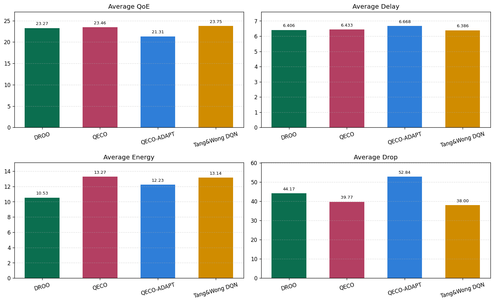
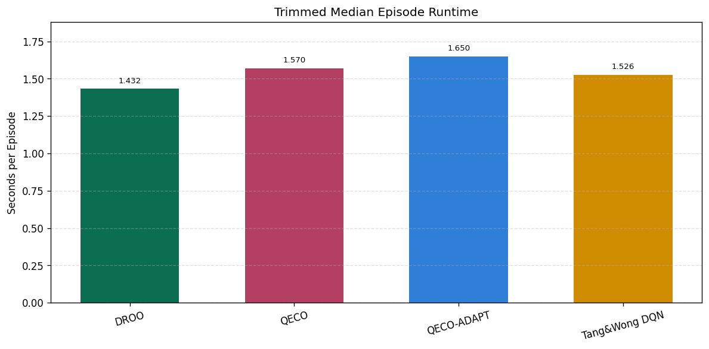
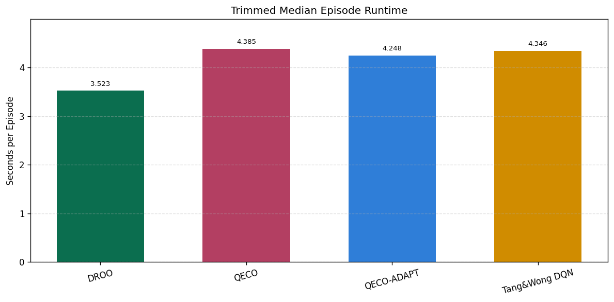
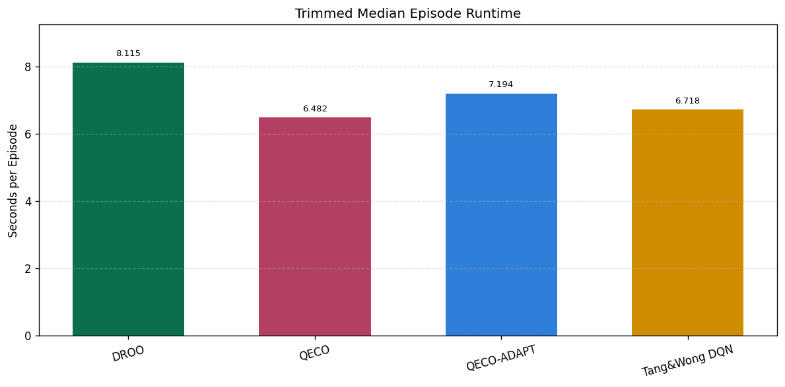
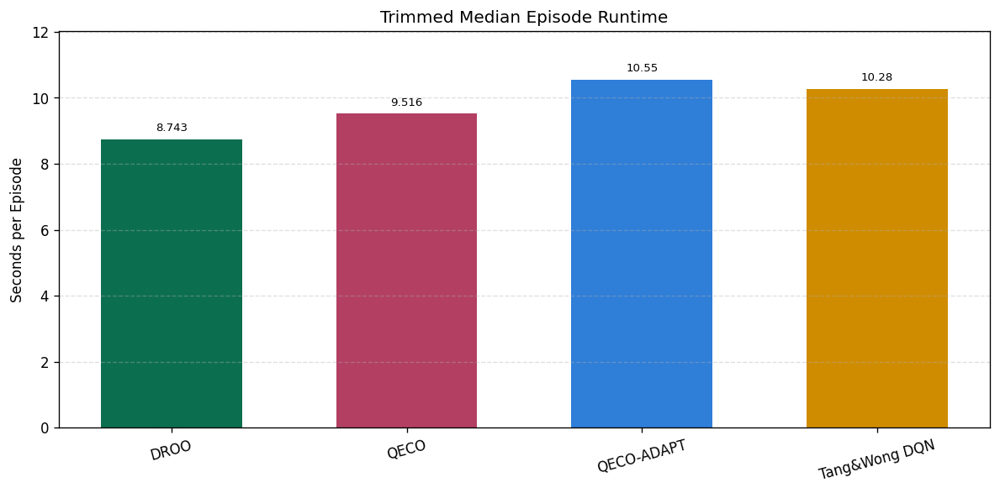

# 단일 엣지 Dense MEC 환경에서 QECO-ADAPT의 부하 적응 효과 분석

## Abstract

본 분석은 QoE-Oriented Computation Offloading (QECO)의 원문 실험 환경을 기준점으로 삼아, 단일 엣지 모바일 엣지 컴퓨팅(Mobile Edge Computing, MEC) 환경에서 사용자 밀도가 증가할 때 QECO-ADAPT가 기존 QECO 대비 어떤 이점을 가지는지 평가한다. QECO 원문은 기본 시뮬레이션 환경으로 50 mobile devices (MDs)와 5 edge nodes (ENs)를 사용하므로, edge당 평균 사용자 밀도는 10 MDs/EN이다 [2]. 본 분석은 edge 수를 1로 고정하고 사용자 수를 10, 30, 50, 80으로 증가시켜 원문 기본 밀도 대비 1x, 3x, 5x, 8x 수준의 단일 엣지 dense stress condition을 구성한다. 결과적으로 QECO-ADAPT는 저부하에 해당하는 1x 조건에서는 QoE와 Drop 측면에서 불리했으나, 5x 조건인 user=50부터 QoE, Delay, Energy, Drop을 동시에 개선하였다. 8x 조건인 user=80에서는 Drop 개선 폭은 제한적이지만 QoE와 Energy 개선이 유지되었다. 따라서 QECO-ADAPT는 원문 QECO의 기본 실험 밀도에서는 보편적 대체 알고리즘으로 보기 어렵지만, 단일 EN에 사용자 부하가 집중되는 dense MEC 조건에서는 QECO의 QoE 중심 정책을 보완하는 부하 적응형 에너지 제어 방식으로 해석할 수 있다.

**Index Terms**--Mobile edge computing, computation offloading, QECO, QECO-ADAPT, dense MEC, energy-aware control, task drop.

## I. Introduction

모바일 엣지 컴퓨팅(MEC)에서 computation offloading은 사용자 단말의 제한된 계산 능력과 배터리 제약을 완화하기 위한 핵심 기술이다. 그러나 사용자가 증가하고 edge node의 처리 부하가 커질수록 task delay, energy consumption, deadline violation이 함께 증가할 수 있다. 특히 단일 edge node에 많은 사용자가 집중되는 dense 환경에서는 offloading decision의 작은 변화가 QoE, Energy, Drop에 동시에 영향을 준다.

DROO는 online computation offloading에서 반복 최적화의 계산 비용을 낮추기 위해 deep reinforcement learning을 사용하는 대표적 접근이다 [1]. QECO는 사용자 QoE를 중심으로 delay와 energy를 함께 고려하는 DRL 기반 offloading 알고리즘이며, dynamic workload at ENs를 중요한 요소로 다룬다 [2]. 또한 learning-to-optimize 연구는 무선 자원 관리에서 반복 최적화의 real-time 처리 부담을 DNN 기반 근사로 완화할 수 있음을 보인다 [3]. Lyapunov-guided DRL, online dynamic multi-user offloading, Tang and Wong-style DRL, partial offloading 연구도 stochastic task arrival, edge load dynamics, queue stability, deadline expiration을 MEC offloading의 핵심 제약으로 다룬다 [4]-[7].

본 분석은 이러한 문헌 흐름을 바탕으로 QECO-ADAPT를 단일 edge dense 환경에서 검토한다. QECO 원문 실험은 50 MDs와 5 ENs를 기본 환경으로 사용하며, 이는 edge당 평균 10명의 사용자를 가정한 구조이다 [2]. 본 분석은 이 원문 기본 환경을 밀도 기준점으로 사용한다. 즉 원문과 동일한 전체 시스템 규모를 재현하는 것이 아니라, 원문에서의 edge당 사용자 밀도를 기준으로 단일 edge 상황에서 부하가 증가할 때 QECO-ADAPT의 동작이 어떻게 달라지는지를 평가한다.

QECO-ADAPT는 기존 QECO의 QoE 중심 reward 구조 위에 effective load 기반 energy weight 조절을 결합한 변형이다. 이 방식은 낮은 부하에서 항상 유리하도록 설계된 것이 아니라, edge 하나가 감당해야 하는 task pressure가 커질 때 energy-aware behavior를 강화하도록 설계된다. 따라서 본 분석의 핵심 질문은 다음과 같다.

**단일 edge 환경에서 사용자 밀도가 원문 QECO 기본 밀도보다 3x, 5x, 8x로 증가할 때, QECO-ADAPT는 QECO 대비 QoE-Delay-Energy-Drop 균형을 개선하는가?**

## II. Reference Environment and Dense Stress Setup

### A. Original QECO Reference

QECO 원문은 성능 평가에서 50 MDs와 5 ENs를 사용하는 MEC 환경을 고려한다 [2]. 또한 학습은 1000 episodes로 구성되며, 각 episode는 100 time slots, 각 slot은 0.1 s로 정의된다. 본 분석에서 특히 중요한 값은 전체 MD 수 자체보다 edge당 사용자 밀도이다.

| 항목 | QECO 원문 기본 환경 |
| --- | ---: |
| Mobile devices | 50 |
| Edge nodes | 5 |
| Users per edge | 10 |
| Episodes | 1000 |
| Time slots per episode | 100 |
| Slot length | 0.1 s |

따라서 원문 기본 환경은 평균적으로 한 edge node가 10명의 MD를 감당하는 부하 조건으로 해석할 수 있다. 본 분석에서는 이 값을 dense stress의 기준 밀도 \(d_0=10\)으로 둔다.

### B. Single-Edge Dense Setup

본 분석의 실험 조건은 edge 수를 1로 고정하고 사용자 수를 증가시키는 방식이다. 이렇게 하면 edge 확장 효과가 제거되므로, 단일 EN이 감당해야 하는 사용자 밀도 증가가 지표에 미치는 영향을 직접 볼 수 있다.

| 시나리오 | Users | Edges | Users per edge | QECO 원문 기준 밀도 |
| --- | ---: | ---: | ---: | ---: |
| S1 | 10 | 1 | 10 | 1x |
| S2 | 30 | 1 | 30 | 3x |
| S4 | 50 | 1 | 50 | 5x |
| S6 | 80 | 1 | 80 | 8x |

모든 비교는 raw episode metric의 마지막 10% 구간 평균을 사용한다. `QoE`는 높을수록 좋고, `Delay`, `Energy`, `Drop`, `Runtime`은 낮을수록 좋다. 본 분석은 QECO와 QECO-ADAPT의 차이를 중심으로 하며, 변화량은 다음과 같이 정의한다.

\[
\Delta X = X_{\mathrm{QECO\text{-}ADAPT}} - X_{\mathrm{QECO}}
\]

따라서 QoE는 \(\Delta X>0\)일 때 개선이며, Delay, Energy, Drop, Runtime은 \(\Delta X<0\)일 때 개선이다. 지표 집계 방식은 그림 1에 정리하였다.

**Fig. 1. Metric aggregation formulas.** Task-level metric, episode-level metric, and final 10% aggregation used in the comparison tables and bar charts.

## III. QECO-ADAPT Formulation

QECO-ADAPT는 사용자 수, 시간대별 task arrival profile, 사용자 활동성, edge 수를 이용해 effective load를 추정하고, 이를 energy weight와 offloading 보수화 강도에 반영한다. 이 설계는 explicit Lyapunov optimization이나 per-frame iterative solver를 추가하지 않고, QECO의 reward 구조 위에 lightweight adaptive control을 덧붙이는 방식이다. 이는 online wireless resource management에서 계산 비용을 줄이려는 learning-to-optimize 흐름 [3]과, stochastic task arrivals 및 queue stability를 고려하는 MEC offloading 연구 [4]-[7]의 문제의식을 가볍게 결합한 형태이다.

**Fig. 2. QECO-ADAPT mathematical definitions.** Task arrival model, effective load, adaptive gating, and adaptive energy reward definitions.

그림 2의 핵심은 effective load가 edge 하나가 평균적으로 감당해야 하는 task arrival pressure를 나타낸다는 점이다. 사용자가 증가하면 load는 증가하고, edge 수가 증가하면 edge당 load는 감소한다. 본 분석은 edge 수를 1로 고정하므로 사용자 수 증가가 곧 단일 edge dense stress 증가로 연결된다.

**Fig. 3. QECO-ADAPT adaptive formula.** User-count-dependent gating strength and adaptive energy weight.

**Fig. 4. QECO-ADAPT constant calibration.** Calibration constants and edge-scaled gating behavior used by QECO-ADAPT.

## IV. Results

아래 표는 단일 edge dense 증가 조건에서 QECO 대비 QECO-ADAPT의 변화량을 정리한 것이다. 괄호 안의 값은 QECO 대비 상대 변화율이다. 최신 그림 자료는 bar 상단에 각 bar height에 해당하는 수치를 직접 표기하도록 갱신되었으며, 표의 final 10% 값과 동일한 source metric을 사용한다.

| Users | Density vs. QECO original | ΔQoE | ΔDelay | ΔEnergy | ΔDrop | ΔRuntime |
| ---: | ---: | ---: | ---: | ---: | ---: | ---: |
| 10 | 1x | -1.7895 (-6.54%) | +0.3271 (+5.74%) | -0.9622 (-7.56%) | +10.9500 (+63.48%) | +0.0796 (+5.07%) |
| 30 | 3x | -0.0709 (-0.40%) | -0.0129 (-0.17%) | -0.3169 (-2.06%) | +4.8500 (+1.95%) | -0.1366 (-3.12%) |
| 50 | 5x | +0.2907 (+2.12%) | -0.0367 (-0.47%) | -0.3488 (-2.53%) | -11.3750 (-2.03%) | +0.7119 (+10.98%) |
| 80 | 8x | +0.2094 (+1.82%) | -0.0344 (-0.42%) | -0.6711 (-5.42%) | -6.6750 (-0.65%) | +1.0311 (+10.83%) |

### A. 1x Density: 원문 기본 edge당 밀도 수준

`user=10, edge=1`은 QECO 원문의 edge당 평균 사용자 밀도와 같은 1x 조건이다. 이 조건에서 QECO-ADAPT는 Energy를 7.56% 줄였지만 QoE는 6.54% 감소했고 Drop은 63.48% 증가했다. 이는 원문 기본 밀도 수준에서는 QECO의 기본 QoE 중심 균형이 더 적합하다는 점을 보여준다. 즉 낮은 부하에서는 adaptive energy penalty가 불필요하게 보수적으로 작동할 수 있으며, 이 경우 Energy 절감이 task completion 안정성 손실을 상쇄하지 못한다.

<table>
  <tr>
    <td width="50%" align="center">
       
       
      
    </td>
    <td width="50%" align="center">
      
    </td>
  </tr>
</table>

**Fig. 5. S1 single-edge 1x density comparison.** Bar charts include upper labels that show the exact plotted values.

### B. 3x Density: 전이 구간

`user=30, edge=1`은 원문 기준 3x 밀도이다. 이 조건에서는 QECO-ADAPT가 Delay, Energy, Runtime을 각각 0.17%, 2.06%, 3.12% 줄였지만 QoE는 0.40% 낮아지고 Drop은 1.95% 증가했다. 즉 3x 조건은 QECO-ADAPT의 이점이 일부 나타나기 시작하지만, 아직 Drop 안정화까지 이어지지는 않는 전이 구간이다. 이 결과는 QECO-ADAPT의 부하 적응 효과가 낮은 부하에서 즉시 나타나는 것이 아니라, 일정 이상의 congestion pressure가 형성된 뒤에 명확해진다는 점을 시사한다.

<table>
  <tr>
    <td width="50%" align="center">
       
       
      
    </td>
    <td width="50%" align="center">
      
    </td>
  </tr>
</table>

**Fig. 6. S2 single-edge 3x density comparison.** QECO-ADAPT starts reducing Delay, Energy, and Runtime, but Drop remains slightly worse than QECO.

### C. 5x Density: QECO-ADAPT의 주요 개선 구간

`user=50, edge=1`은 원문 기준 5x 밀도이며, 본 분석에서 QECO-ADAPT의 장점이 가장 균형 있게 확인된 조건이다. QECO-ADAPT는 QoE를 2.12% 높이고, Delay를 0.47%, Energy를 2.53%, Drop을 2.03% 낮췄다. Dense MEC에서 중요한 점은 Energy만 낮추는 것이 아니라, QoE와 Drop을 동시에 보존하거나 개선하는 것이다. 이 조건에서 QECO-ADAPT는 Energy 절감이 Drop 악화로 이어지지 않았고, 오히려 task completion 안정성까지 소폭 개선했다. 따라서 5x density는 QECO-ADAPT를 적용할 수 있는 실질적 threshold로 해석할 수 있다.

<table>
  <tr>
    <td width="50%" align="center">
       
       
      
    </td>
    <td width="50%" align="center">
      
    </td>
  </tr>
</table>

**Fig. 7. S4 single-edge 5x density comparison.** This is the clearest dense-threshold case where QECO-ADAPT improves QoE, Delay, Energy, and Drop over QECO.

### D. 8x Density: 극고밀도 단일 edge 조건

`user=80, edge=1`은 원문 기준 8x 밀도이다. 이 조건에서 QECO-ADAPT는 QoE를 1.82% 높이고 Energy를 5.42% 줄였다. Drop 감소는 0.65%로 제한적이지만, 단일 edge가 80명의 사용자를 감당하는 극단적인 조건에서는 모든 알고리즘이 deadline pressure를 강하게 받는다. 따라서 이 구간의 QECO-ADAPT 이점은 Drop을 급격히 낮추는 것보다, 높은 혼잡 속에서도 QoE를 유지하면서 Energy pressure를 크게 완화하는 데 있다.

<table>
  <tr>
    <td width="50%" align="center">
       
       
      
    </td>
    <td width="50%" align="center">
      
    </td>
  </tr>
</table>

**Fig. 8. S6 single-edge 8x density comparison.** QECO-ADAPT preserves QoE improvement and reduces Energy under extreme single-edge congestion.

## V. Discussion

실험 결과는 QECO-ADAPT가 원문 QECO의 기본 실험 밀도인 1x 조건에서 바로 우수한 것이 아니라, 단일 edge 부하가 충분히 증가할 때 장점이 나타나는 환경 의존형 변형임을 보여준다. 이는 QECO-ADAPT의 설계 의도와도 일치한다. Adaptive energy weight는 부하가 커질수록 energy-aware behavior를 강화하므로, 처리 여유가 충분한 1x 조건에서는 오히려 QoE와 Drop 손실로 나타날 수 있다. 그러나 5x 이상의 dense 조건에서는 동일한 보수화가 불필요한 energy usage를 줄이고 task completion 안정성을 유지하는 방향으로 작동한다.

이 결과는 MEC dense 환경에서 edge load dynamics와 deadline expiration이 중요하다는 기존 연구 흐름과도 연결된다. Tang and Wong은 edge load dynamics, non-divisible tasks, dropped-task ratio를 명시적으로 다루며 [6], Lyapunov-guided DRL과 online dynamic offloading 연구들은 stochastic task arrival, queue stability, resource allocation의 결합 문제를 강조한다 [4], [5]. Partial offloading 연구 또한 online MEC에서 channel, energy, computation resource가 동시에 변하는 조건을 고려한다 [7]. 본 분석의 단일 edge stress setup은 이러한 문제의식을 edge 확장 효과 없이 관찰하기 위한 제한적이지만 해석 가능한 실험 조건이다.

Runtime 측면에서는 `user=50`과 `user=80`에서 QECO-ADAPT가 QECO보다 약 11% 더 긴 trimmed median episode runtime을 보였다. 이 증가는 QECO-ADAPT가 추가적인 adaptive weighting을 수행하기 때문에 발생하는 비용으로 해석할 수 있다. 다만 이는 반복 최적화 기반 알고리즘에서 발생하는 구조적 overhead와는 다르며, QECO와 같은 실행 시간 범위 안에서 발생한 증가이다. 따라서 dense 단일 edge 환경에서는 약 10% 내외의 runtime overhead를 감수하고 Energy와 QoE 균형 개선을 얻을 수 있는지가 적용 여부의 핵심 판단 기준이 된다.

또한 본 분석은 원문 QECO 환경을 그대로 재현한 실험이 아니다. 원문은 5 ENs를 사용하는 다중 edge 환경이며, 본 분석은 edge 수를 1로 고정한 stress test이다. 따라서 결과의 의미는 "QECO 원문보다 우수하다"가 아니라, "원문 기본 edge당 사용자 밀도를 기준으로 단일 edge 부하가 증가할 때 QECO-ADAPT의 유효 구간이 어디에서 나타나는가"에 있다. 이 관점에서 user=50과 user=80 조건은 QECO-ADAPT의 dense-aware control이 실험적으로 의미를 가지는 구간이다.

## VI. Conclusion

QECO 원문 기본 환경은 50 MDs와 5 ENs로 구성되며, edge당 평균 사용자 밀도는 10 MDs/EN이다 [2]. 본 분석은 이 값을 기준으로 단일 edge 환경에서 1x, 3x, 5x, 8x dense stress condition을 구성하였다. 결과적으로 QECO-ADAPT는 1x 조건에서는 QECO 대비 불리했지만, 5x 조건부터 QoE, Delay, Energy, Drop을 동시에 개선하였다. 8x 조건에서는 Drop 개선은 제한적이었으나 QoE와 Energy 개선이 유지되었다.

따라서 QECO-ADAPT는 원문 QECO의 기본 부하 조건을 대체하기 위한 범용 알고리즘이라기보다, 단일 edge에 사용자 밀도가 집중되는 dense MEC 환경에서 QECO의 QoE 중심 정책을 보완하는 부하 적응형 에너지 제어 알고리즘으로 정의하는 것이 타당하다. 특히 `user=50, edge=1`은 현재 결과 기준으로 QECO-ADAPT의 적용 타당성이 가장 뚜렷하게 확인된 대표 조건이다.

## References

[1] L. Huang, S. Bi, and Y.-J. Angela Zhang, "Deep Reinforcement Learning for Online Computation Offloading in Wireless Powered Mobile-Edge Computing Networks," *IEEE Transactions on Mobile Computing*, vol. 19, no. 11, pp. 2581-2593, Nov. 2020, doi: 10.1109/TMC.2019.2928811.

[2] I. Rahmaty, H. Shah-Mansouri, and A. Movaghar, "QECO: A QoE-Oriented Computation Offloading Algorithm Based on Deep Reinforcement Learning for Mobile Edge Computing," *IEEE Transactions on Network Science and Engineering*, vol. 12, no. 4, pp. 3118-3130, 2025, doi: 10.1109/TNSE.2025.3556809.

[3] H. Sun, X. Chen, Q. Shi, M. Hong, X. Fu, and N. D. Sidiropoulos, "Learning to optimize: Training deep neural networks for wireless resource management," in *Proc. IEEE SPAWC*, 2017, pp. 1-6, doi: 10.1109/SPAWC.2017.8227766.

[4] S. Bi, L. Huang, H. Wang, and Y.-J. A. Zhang, "Lyapunov-Guided Deep Reinforcement Learning for Stable Online Computation Offloading in Mobile-Edge Computing Networks," *IEEE Transactions on Wireless Communications*, vol. 20, no. 11, pp. 7519-7537, 2021, doi: 10.1109/TWC.2021.3085319.

[5] S. Chen and W. Jiang, "Online dynamic multi-user computation offloading and resource allocation for HAP-assisted MEC: an energy efficient approach," *Journal of Cloud Computing*, vol. 13, article 92, 2024, doi: 10.1186/s13677-024-00645-5.

[6] M. Tang and V. W. Wong, "Deep Reinforcement Learning for Task Offloading in Mobile Edge Computing Systems," *IEEE Transactions on Mobile Computing*, vol. 21, no. 6, pp. 1985-1997, Jun. 2022, doi: 10.1109/TMC.2020.3036871.

[7] L. Sun, R. Liang, L. Wan, K. Liu, Z. Ning, and J. Wang, "Online Partial Computation Offloading Optimization in Wireless Powered Mobile Edge Computing Network," *IEEE Transactions on Cognitive Communications and Networking*, vol. 12, pp. 1481-1495, 2026, doi: 10.1109/TCCN.2025.3612741.
