# QECO-ADAPT: 모바일 엣지 컴퓨팅 환경을 위한 부하 적응형 에너지 제어 오프로딩 알고리즘과 공통 평가

## 초록
모바일 엣지 컴퓨팅(Mobile Edge Computing, MEC) 환경의 계산 오프로딩은 사용자 체감 품질(Quality of Experience, QoE), 서비스 지연, 에너지 소비, 그리고 마감 시간 내 작업 완료 여부를 동시에 고려해야 하는 다목적 문제이다. 본 연구는 기존 QoE-Oriented Computation Offloading (QECO)에 부하 적응형 에너지 제어를 결합한 제안 변형 알고리즘 QECO-ADAPT를 정의하고, 이를 Deep Reinforcement Learning for Online Computation Offloading (DROO), 기존 QECO, 그리고 Tang&Wong-style Deep Q-Network (DQN) 기반 알고리즘과 동일한 공통 MEC 테스트베드에서 비교한다. 공통 환경은 동일한 난수 시드, 동일한 작업 생성 파이프라인, 동일한 지연 제한, 동일한 episode 길이를 공유하도록 재구성되었으며, 최종 성능은 마지막 10% episode 구간 평균으로 평가하였다. 총 7개 시나리오(`users=10, 30, 50, 80`, `edges=1, 3, 10`)를 분석한 결과, DROO는 모든 시나리오에서 가장 낮은 에너지 소비를 유지했지만 Drop 성능은 가장 취약했다. QECO는 전반적으로 안정적인 QoE-Delay-Drop 균형을 보여 기본 기준선으로 적합했다. 제안 변형인 QECO-ADAPT는 저부하 단일 edge 환경에서는 QECO 대비 명확한 우위를 보이지 않았으나, 사용자 수가 증가하거나 edge 수가 확대된 환경에서는 QoE와 Delay를 유지하거나 개선하면서 Energy와 Drop을 함께 낮추는 경향을 보였다. 또한 실험 곡선에서는 QECO-ADAPT가 일부 시나리오에서 초반 수렴 구간의 안정화가 더 빠르게 나타나는 경향을 보였으며, 이는 동적 MEC 환경에서 재학습 및 warm-up 비용을 줄이는 잠재적 장점으로 해석될 수 있다 [2]–[7]. Tang&Wong-style DQN은 특히 다중 edge 시나리오에서 QoE와 Drop 측면의 경쟁력이 크게 나타났다. 이러한 결과는 QECO-ADAPT가 모든 환경에서 일괄적으로 우수한 알고리즘이라기보다, 부하와 edge 자원 수준에 따라 효과가 달라지는 환경 민감형 에너지 제어 정책이라는 점을 시사한다.

## 1. 서론
모바일 엣지 컴퓨팅(Mobile Edge Computing, MEC) 시스템에서 모바일 단말은 제한된 계산 자원과 배터리 제약으로 인해 높은 처리 지연과 작업 실패를 경험할 수 있다. 이를 완화하기 위해 작업을 인접 edge 서버로 오프로딩할 수 있으나, 오프로딩 여부와 자원 할당을 동시에 결정하는 문제는 조합적 특성과 동적 환경성 때문에 매우 복잡하다.

Deep Reinforcement Learning for Online Computation Offloading (DROO)는 무선 전력 기반 MEC 환경에서 이진 오프로딩 결정을 심층강화학습(Deep Reinforcement Learning, DRL)으로 근사하여 계산율(weighted sum computation rate)을 높이는 데 초점을 맞춘다 [1]. DROO의 핵심 문제의식은 빠르게 변하는 무선 채널 안에서 혼합정수 최적화 문제를 매 frame마다 직접 풀기 어렵다는 점이며, 이에 따라 학습 기반 정책이 실시간 오프로딩에 적합하다는 근거를 제시한다 [1]. 이러한 관점은 무선 자원 관리에서 반복 최적화 기법의 높은 계산 비용을 심층신경망(Deep Neural Network, DNN) 기반 근사로 낮추려는 learning-to-optimize 연구 흐름과도 연결된다 [3].

반면 QoE-Oriented Computation Offloading (QECO)는 장기 사용자 체감 품질(Quality of Experience, QoE)을 직접 최대화하도록 설계된 분산형 dueling double Deep Q-Network (DQN) 구조를 사용하며, deadline과 에너지 제약을 사용자 경험 관점에서 함께 반영한다 [2]. Tang and Wong의 distributed DQN 기반 오프로딩 연구도 edge node의 load dynamics, non-divisible task, deadline expiration에 따른 task drop을 핵심 문제로 다루며, 평균 delay와 dropped-task ratio를 줄이는 것을 주요 목표로 삼는다 [6]. 이 흐름은 본 연구가 단순 계산율이나 에너지 단독 지표가 아니라 QoE, delay, energy, drop을 함께 관찰해야 하는 이유가 된다.

또한 Lyapunov-guided DRL 및 online dynamic offloading 연구들은 stochastic task arrival, time-varying channel, queue stability를 online MEC의 핵심 제약으로 제시한다 [4], [5], [7]. 다만 이 계열은 queue 안정성 또는 energy-rate trade-off를 강하게 다루는 대신, per-frame 최적화 또는 Lyapunov 기반 보조 문제를 포함하는 경우가 많다. 본 연구의 QECO-ADAPT는 이러한 부하 및 queue 인식 관점을 QECO의 QoE 기반 정책에 가볍게 결합한 변형으로, 환경 부하에 따라 energy penalty와 오프로딩 보수화 강도를 적응적으로 조절한다.

기존 구현은 서로 다른 환경 설정과 시간축을 사용하므로 직접 비교가 어렵다. 이에 본 연구에서는 공통 MEC 평가 환경을 구성하여 DROO, QECO, QECO-ADAPT, Tang&Wong-style DQN [6]을 동일한 조건에서 비교한다. 비교 차트에는 포함하지 않았지만, 좌표하강법(Coordinate Descent, CD)은 동일한 `user=10`, `edge=1`, `episode=400` 보조 실험에서 `trimmed median episode runtime`이 `14.3218s`로 측정되어, QECO의 `1.4273s`, QECO-ADAPT의 `1.4349s`보다 약 10배 길었다. 따라서 CD는 실사용 관점의 주 비교군에서 제외하였다.

## 2. 공통 평가 구조
### 2.1 비교 대상 알고리즘
본 연구의 최종 비교군은 다음 네 알고리즘이다.

| 알고리즘 | 원문 또는 본 연구에서의 최적화 관점 | 본 실험에서의 역할 |
| --- | --- | --- |
| DROO | 무선 전력 기반 MEC에서 weighted sum computation rate를 높이고, 기존 최적화 방식 대비 계산 시간을 줄이는 online offloading [1] | 에너지 효율 및 계산 비용 기준선 |
| QECO | task completion, delay, energy를 반영한 장기 QoE 최대화 [2] | 제안 변형의 직접 기준선 |
| QECO-ADAPT | QECO의 QoE reward 위에 부하 적응형 energy penalty와 offloading gating을 결합 | 본 연구의 제안 변형 |
| Tang&Wong-style DQN | non-divisible, delay-sensitive task에서 edge load dynamics를 고려해 long-term cost, drop, delay를 줄이는 distributed DQN [6] | drop 및 delay 민감 기준선 |

이들은 모두 동일한 공통 환경에서 실행된다. 학습 과정의 time-series 비교와 최종 성능 비교표는 모두 raw episode 시계열을 기준으로 하며, 본 실험에서는 모든 run이 400 episode로 동일하게 기록되었다.

### 2.2 공통 지표
본 연구는 네 가지 핵심 지표를 사용한다.

- `QoE`: 사용자 만족도를 반영하는 종합 보상
- `Delay`: 실제 도착한 작업의 평균 처리 지연
- `Energy`: 실제 도착한 작업의 평균 계산 및 전송 에너지
- `Drop`: 마감 시간 내 완료되지 못한 작업 수

또한 계산 비용 관점을 위해 `trimmed median episode runtime`을 함께 기록한다.

### 2.3 최종 성능 집계 방식
최종 성능은 단일 마지막 episode가 아니라 raw episode 시계열의 마지막 10% 구간 평균으로 정의한다. 이는 수렴 직전의 일시적 진동을 줄이고, 장기 안정 구간의 성능을 비교하기 위한 선택이다. 이때 `QoE`, `Delay`, `Energy`는 episode 내부에서 실제 도착한 task 집합에 대한 산술평균이며, `Drop`은 해당 episode에서 deadline 내 완료되지 못한 task의 총 개수이다.

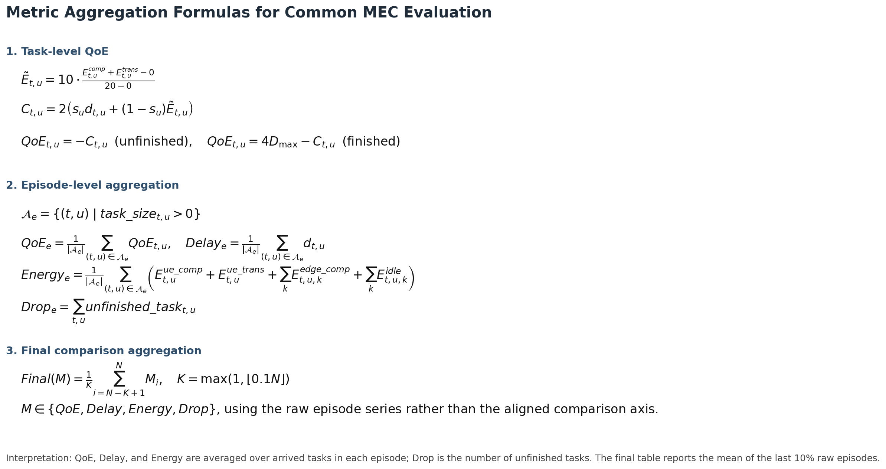

**그림 1. 공통 MEC 평가에서 사용한 task-level QoE, episode-level metric, final 10% 집계식.** 최종 비교표의 final 값은 각 run directory에 저장된 raw episode metric 파일을 기준으로 계산한다.

### 2.4 CD 제외 근거
CD는 품질 지표만 놓고 보면 `user=10`, `edge=1`, `episode=400` 환경에서 마지막 10% 평균 기준 `QoE=22.1509`, `Drop=49.4500` 수준으로 완전히 무의미한 기준선은 아니었다. 그러나 같은 환경에서 CD의 `trimmed median episode runtime`은 `14.3218s`였고, QECO와 QECO-ADAPT는 각각 `1.4273s`, `1.4349s`에 머물렀다. 즉 CD는 같은 공통 환경에서 약 10배 수준의 runtime overhead를 보였으며, 이러한 계산 비용은 반복 실험과 실제 online offloading 관점에서 부담이 크다. 본 연구가 학습 기반 정책의 실사용 가능성을 함께 고려한다는 점에서, CD는 참고용 보조 결과로만 유지하고 주 비교표에서는 제외하였다.

## 3. QECO-ADAPT의 적응형 수식
QECO-ADAPT는 사용자 수, 시간대별 task arrival profile, 사용자 활동성, edge 수를 사용해 유효 부하를 계산하고, 이를 바탕으로 adaptive gating과 energy weight를 조절한다.

### 3.1 Task arrival 모델
$$
\mathcal{U}=\{1,2,\ldots,N\},\quad \mathcal{E}=\{1,2,\ldots,M\}
$$

여기서 $N$은 사용자 수, $M$은 edge node 수이다. 시간대별 기본 task 발생 profile을 다음과 같이 둔다.

$$
\mathbf{b}=(b_1,b_2,\ldots,b_K),\quad 0\le b_k\le 1
$$

사용자별 활동성 계수는 다음 범위에 속한다고 정의한다.

$$
a_u\in[a_{\min},a_{\max}],\quad u\in\mathcal{U}
$$

따라서 사용자 $u$가 시간 구간 $t$에서 task를 발생시킬 확률은 다음과 같이 정의한다.

$$
p_{arrive}(u,t)
=\min\left(1,\max\left(0,b_{\kappa(t)}a_u\right)\right)
$$

여기서 $\kappa(t)\in\{1,\ldots,K\}$는 episode 내부 시간 $t$가 속한 base profile index이다. 본 실험에서는 $\mathbf{b}=(0.18,0.30,0.42,0.24)$, $a_{\min}=0.7$, $a_{\max}=1.3$을 사용하였다. 현재 profile 범위에서는 $b_{\kappa(t)}a_u\le 0.546$이므로 clipping은 안전장치로만 작동한다.

### 3.2 Effective load
$$
\bar{b}=\frac{1}{K}\sum_{k=1}^{K}b_k
$$

$$
\bar{a}=\frac{1}{N}\sum_{u=1}^{N}a_u
$$

본 구현에서는 사용자 활동성을 $a_{\min}$부터 $a_{\max}$까지 균등하게 배치하므로 다음과 같이 근사된다.

$$
\bar{a}=\frac{a_{\min}+a_{\max}}{2}
$$

QECO-ADAPT의 유효 부하는 edge 하나가 평균적으로 감당해야 하는 expected task arrival intensity로 정의한다.

$$
L_{eff}=\frac{N\bar{b}\bar{a}}{M}
$$

즉 사용자 수 $N$이 증가하면 부하는 증가하고, edge 수 $M$이 증가하면 edge당 부하는 감소한다. 본 실험의 기본 profile에서는 $\bar{b}=0.285$, $\bar{a}=1.0$이다.

### 3.3 Adaptive gating
$$
c=M\lambda
$$

여기서 $\lambda$는 edge당 부하 스케일 상수이며, 본 실험에서는 $\lambda=10$을 사용한다. Adaptive gating strength는 다음과 같이 정의한다.

$$
g(L_{eff})
=\frac{L_{eff}}{L_{eff}+c}
=\frac{L_{eff}}{L_{eff}+M\lambda}
$$

이때 $g(L_{\mathrm{eff}})\in[0,1)$이며, $L_{\mathrm{eff}}$가 커질수록 $g$는 단조 증가한다.

$$
\frac{\partial g}{\partial L_{eff}}
=\frac{M\lambda}{(L_{eff}+M\lambda)^2}>0
$$

또한 $M\lambda$가 커질수록 같은 부하에서 $g$의 증가가 완만해진다. 이는 edge 수가 많거나 스케일 상수가 클수록 보수화 계수가 덜 민감하게 증가하도록 설계된 것이다.

### 3.4 Adaptive energy weight
$$
w_E = w_0\left(1+g(L_{eff})\right)^{\rho}
$$

여기서 $w_E$는 QECO-ADAPT reward에서 사용하는 adaptive energy weight, $w_0$는 기본 energy weight, $\rho$는 증가 곡률을 조절하는 exponent이다. 본 실험에서는 $w_0=1.20$, $\rho=0.35$를 사용하였다.

따라서 task $i$의 에너지 비용 항은 기존 QECO의 scaled energy에 $w_E$를 곱해 다음처럼 강화된다.

$$
E^{scaled}_i
=10\cdot Normalize(E^{comp}_i+E^{trans}_i;0,20)
$$

$$
C_i^{adapt}
=2\left(s_iD_i+(1-s_i)w_EE^{scaled}_i\right)
$$

$$
r_i^{adapt}=
\begin{cases}
-C_i^{adapt}, & \text{if unfinished} \\
4D_{\max}-C_i^{adapt}, & \text{otherwise}
\end{cases}
$$

여기서 $s_i$는 사용자 단말의 energy state, $D_i$는 task delay, $D_{\max}$는 최대 허용 delay이다. 위 정의를 하나의 수식 도식으로 정리하면 다음과 같다.

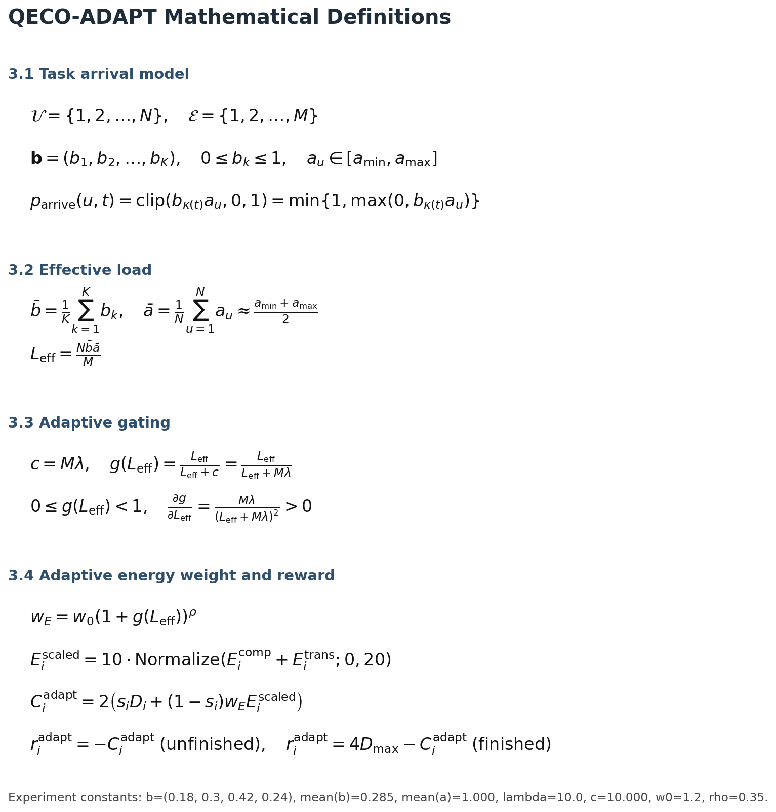

**그림 2. QECO-ADAPT의 task arrival, effective load, adaptive gating, adaptive energy reward 정의식.**

이 식은 부하가 증가할수록 에너지 penalty를 강화하되, edge 수가 늘어나면 gating을 완화하도록 설계되었다. 사용자 수 변화에 따른 `gating_strength`와 `energy_weight`의 변화는 다음 수식 시각화 그래프로 함께 제시한다.

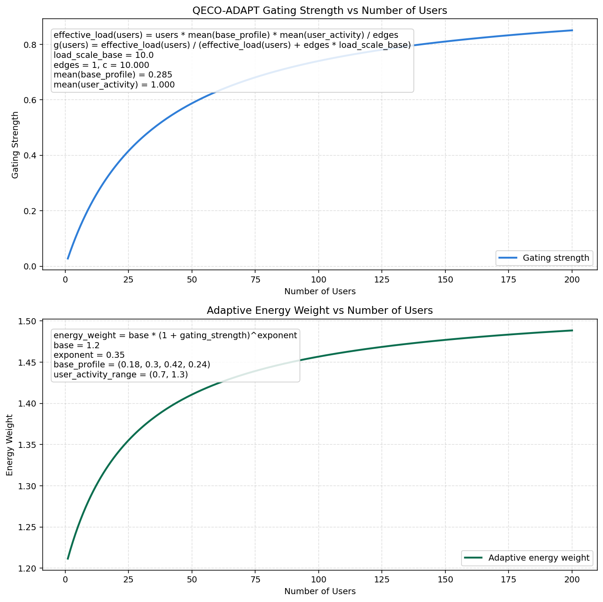

**그림 3. QECO-ADAPT의 사용자 수 기반 adaptive gating strength와 adaptive energy weight 변화.**

### 3.5 상수 설정 근거
본 연구에서 사용한 $\mathbf{b}=(0.18,0.30,0.42,0.24)$, $a_{\min}=0.7$, $a_{\max}=1.3$, $\lambda=10$, $w_0=1.20$, $\rho=0.35$는 닫힌형 최적해에서 직접 도출된 값이 아니라, 공통 MEC 실험환경에서 QECO의 QoE 안정성을 크게 해치지 않으면서 부하 증가에 따른 energy-aware behavior를 유도하기 위한 calibration parameter이다.

먼저 $\mathbf{b}$는 시간대별 task arrival profile을 나타낸다. 기존 공통 환경의 기본 task arrival probability가 0.3이었으므로, profile 평균이 이에 가깝도록 $\bar{b}=0.285$가 되게 설정하였다. 즉 전체 평균 부하는 기존 QECO 실험조건과 크게 다르지 않게 유지하면서, episode 내부에서는 저활동 구간, 일반 구간, peak 구간, 완화 구간이 나타나도록 한 것이다. $a_{\min}=0.7$, $a_{\max}=1.3$은 사용자별 활동성 차이를 표현하되, 평균 활동성 $\bar{a}=(a_{\min}+a_{\max})/2=1.0$이 되도록 하여 전체 평균 arrival scale을 임의로 키우지 않도록 설계하였다.

$\lambda=10$은 전체 scale constant가 아니라 edge당 부하 스케일 상수이다. 실제 gating denominator에 들어가는 값은 $c=M\lambda$이므로 edge 수 $M$에 비례한다. 따라서 edge 수가 증가하면 $L_{\mathrm{eff}}=N\bar{b}\bar{a}/M$는 감소하고, 동시에 $c=M\lambda$는 증가한다. 이 두 효과 때문에 edge 자원이 충분한 환경에서는 gating이 과도하게 커지지 않는다. 예를 들어 $N=30$일 때 $M=1$이면 $L_{\mathrm{eff}}=8.55$, $c=10$, $g=0.461$이지만, $M=3$이면 $L_{\mathrm{eff}}=2.85$, $c=30$, $g=0.087$로 완화된다. 이는 edge capacity가 늘어난 상황에서 불필요하게 오프로딩을 보수화하지 않기 위한 구조이다.

마지막으로 $w_0=1.20$은 QECO 대비 energy term을 기본적으로 약간 더 민감하게 보기 위한 기준 weight이며, $\rho=0.35$는 부하 증가에 따른 energy penalty 증가를 sublinear하게 만드는 exponent이다. $\rho<1$로 두면 user 수가 증가하더라도 energy weight가 급격히 폭증하지 않으므로, energy saving을 유도하면서도 QoE와 Drop이 급격히 악화되는 것을 완화할 수 있다. 이러한 상수 설정의 역할은 그림 4에 요약하였다.

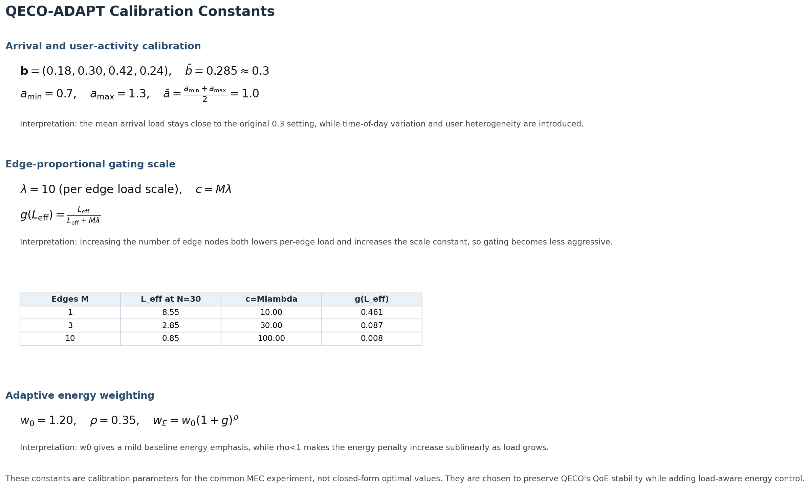

**그림 4. QECO-ADAPT calibration constant의 의미와 edge 수에 따른 gating scale 변화.**

### 3.6 원문 기반 설계 근거
QECO-ADAPT의 적응형 항은 기존 연구의 세 가지 문제의식을 결합한다. 첫째, Tang and Wong의 MEC 오프로딩 모델은 edge node에 많은 task가 몰릴 때 processing delay가 커지고 deadline expiration에 의해 task가 drop될 수 있음을 명확히 다룬다 [6]. 따라서 사용자 수만 보는 대신, 사용자 활동성과 시간대별 task 발생 패턴을 포함한 `p_arrive(u,t)`를 도입하여 실제로 edge에 가해지는 도착 부하를 추정한다.

둘째, Lyapunov-guided DRL, Energy Efficient Dynamic Offloading (EEDO), Lyapunov optimization and Deep Reinforcement learning based Partial Offloading (LyDROP) 계열 연구는 stochastic task arrival과 queue backlog가 online offloading의 안정성을 좌우한다고 본다 [4], [5], [7]. QECO-ADAPT는 이들과 달리 명시적인 Lyapunov drift-plus-penalty 최적화 문제를 매 frame 풀지는 않는다. 대신 `effective_load`를 통해 사용자 수, 평균 활동성, edge 수를 하나의 부하 지표로 압축하고, 이 값이 증가할수록 energy weight를 완만하게 키운다. 즉 queue 안정성의 형식적 보장은 제공하지 않지만, 높은 부하에서 과도한 오프로딩과 에너지 소비를 억제하는 lightweight penalty 조절 방식으로 설계되었다.

셋째, DROO와 learning-to-optimize 계열 연구는 online wireless resource management에서 반복 최적화의 계산 비용이 실시간 운용의 병목이 될 수 있음을 강조한다 [1], [3]. QECO-ADAPT의 gating은 별도 반복 최적화 없이 닫힌형 수식으로 계산되므로, QECO의 실행 구조를 크게 바꾸지 않으면서 부하 반응성을 추가한다. 이는 본 실험에서 QECO-ADAPT의 runtime이 QECO와 같은 초 단위 범위에 머무는 이유이기도 하다.

## 4. 실험 시나리오
현재까지 정리된 공통 비교 시나리오는 총 7개이다.

| 시나리오 | 사용자 수 | edge 수 | episode | 조건 설명 |
| --- | ---: | ---: | ---: | --- |
| S1 | 10 | 1 | 400 | 저부하 단일 edge |
| S2 | 30 | 1 | 400 | 중간 부하 단일 edge |
| S3 | 30 | 3 | 400 | 중간 부하 다중 edge |
| S4 | 50 | 1 | 400 | 고부하 단일 edge |
| S5 | 50 | 10 | 400 | 고부하 다중 edge |
| S6 | 80 | 1 | 400 | 매우 높은 부하 단일 edge |
| S7 | 80 | 3 | 400 | 매우 높은 부하 다중 edge |

## 5. 시나리오별 최종 비교 결과
### 5.1 대표 시나리오 결과
아래 표는 네 개의 대표 시나리오에서 마지막 10% 평균 기준 결과를 정리한 것이다. S1은 저부하 단일 edge, S2는 중간 부하 단일 edge, S3는 edge 확장 효과, S4는 QECO-ADAPT의 고부하 단일 edge 개선 효과를 확인하기 위한 대표 조건이다.

#### S1: `user=10`, `edge=1`
| 알고리즘 | QoE | Delay | Energy | Drop | Runtime |
| --- | ---: | ---: | ---: | ---: | ---: |
| DROO | 23.9827 | 6.2892 | 10.2946 | 40.4500 | 1.4322 |
| QECO | 27.3771 | 5.7007 | 12.7353 | 17.2500 | 1.5699 |
| QECO-ADAPT | 25.5875 | 6.0278 | 11.7731 | 28.2000 | 1.6495 |
| Tang&Wong-style DQN | 27.3787 | 5.7235 | 12.5351 | 17.3500 | 1.5264 |

#### S2: `user=30`, `edge=1`
| 알고리즘 | QoE | Delay | Energy | Drop | Runtime |
| --- | ---: | ---: | ---: | ---: | ---: |
| DROO | 13.1564 | 7.9045 | 8.6252 | 343.6000 | 3.5228 |
| QECO | 17.6899 | 7.4387 | 15.3996 | 248.2250 | 4.3848 |
| QECO-ADAPT | 17.6190 | 7.4259 | 15.0827 | 253.0750 | 4.2482 |
| Tang&Wong-style DQN | 17.5479 | 7.3901 | 15.2895 | 252.2250 | 4.3461 |

#### S3: `user=30`, `edge=3`
| 알고리즘 | QoE | Delay | Energy | Drop | Runtime |
| --- | ---: | ---: | ---: | ---: | ---: |
| DROO | 13.1564 | 7.9045 | 8.6252 | 343.6000 | 3.5470 |
| QECO | 24.9695 | 6.2096 | 12.7714 | 96.4500 | 3.9403 |
| QECO-ADAPT | 25.1768 | 6.1890 | 12.8784 | 92.2750 | 3.9490 |
| Tang&Wong-style DQN | 25.3663 | 6.1607 | 12.8838 | 88.7500 | 3.8265 |

#### S4: `user=50`, `edge=1`
| 알고리즘 | QoE | Delay | Energy | Drop | Runtime |
| --- | ---: | ---: | ---: | ---: | ---: |
| DROO | 10.5458 | 8.2509 | 8.5246 | 668.2000 | 8.1153 |
| QECO | 13.7011 | 7.8765 | 13.7785 | 559.2750 | 6.4818 |
| QECO-ADAPT | 13.9918 | 7.8397 | 13.4297 | 547.9000 | 7.1937 |
| Tang&Wong-style DQN | 13.8898 | 7.8436 | 13.4428 | 553.8750 | 6.7177 |

### 5.2 비교 그래프 자료
표 5.1의 수치 결과를 보완하기 위해, 모든 주요 시나리오에 대한 final 10% 평균 그래프와 episode 기반 time-series 그래프를 함께 제시하였다. 아래 그림들은 하나의 통합 이미지가 아니라 각 시나리오별 원본 PNG 파일을 개별로 연결한 것이다. 따라서 GitHub 저장소에서도 각 그래프 파일이 독립적으로 관리되며, 본문에서 이미지를 클릭하면 원본 크기로 확인할 수 있다.

#### S1: `user=10`, `edge=1`

  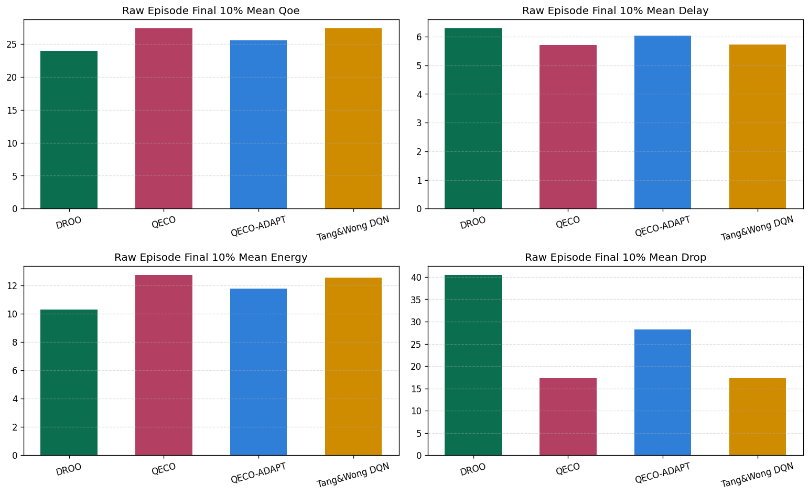
  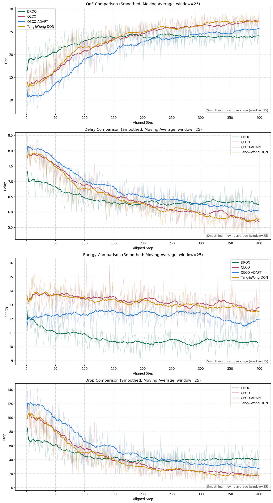

**그림 5. S1 저부하 단일 edge 환경의 비교 그래프.** 왼쪽은 final 10% 평균 지표, 오른쪽은 episode 기반 smoothed time-series이다.

#### S2: `user=30`, `edge=1`

  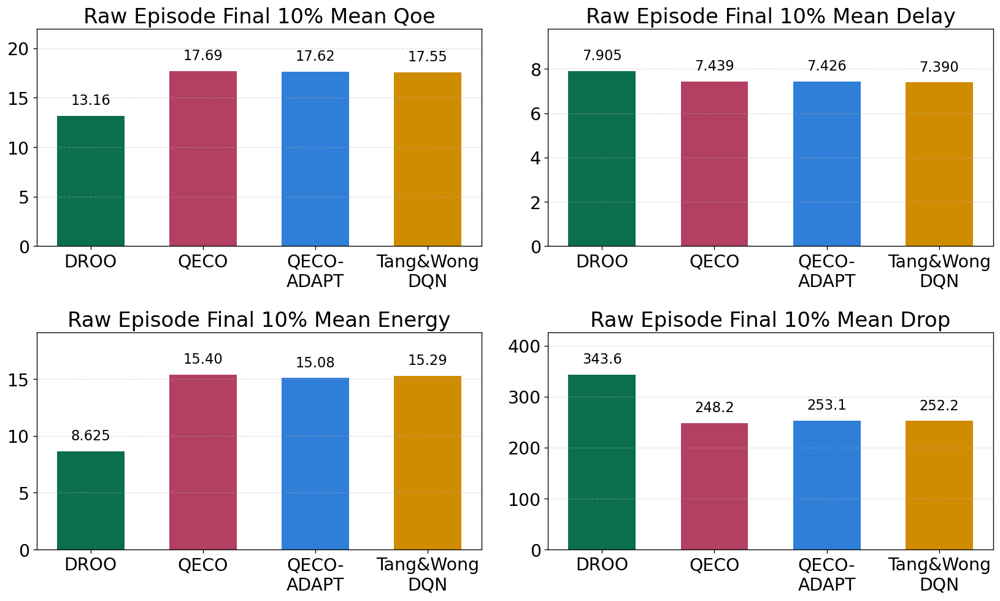
  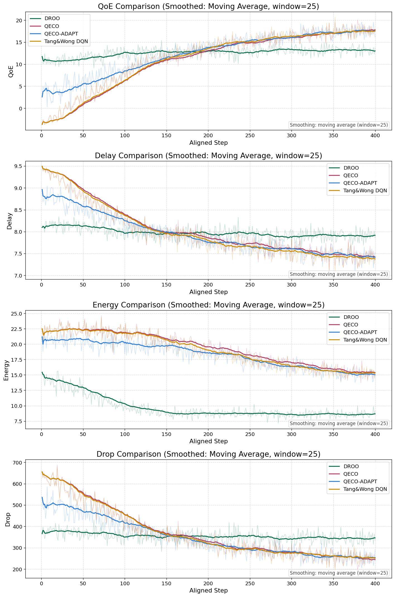

**그림 6. S2 중간 부하 단일 edge 환경의 비교 그래프.** 왼쪽은 final 10% 평균 지표, 오른쪽은 episode 기반 smoothed time-series이다.

#### S3: `user=30`, `edge=3`

  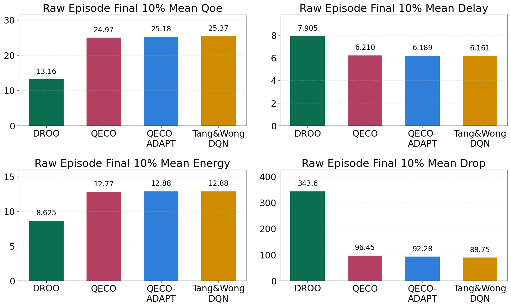
  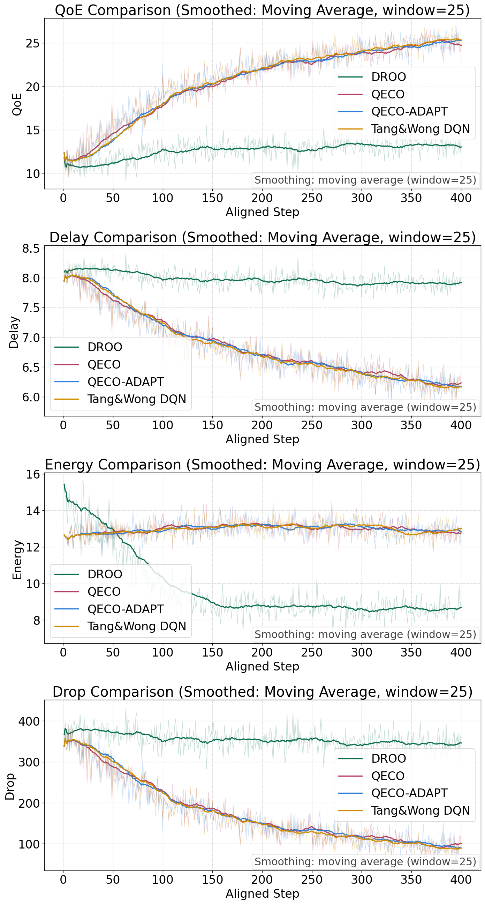

**그림 7. S3 중간 부하 다중 edge 환경의 비교 그래프.** 왼쪽은 final 10% 평균 지표, 오른쪽은 episode 기반 smoothed time-series이다.

#### S4: `user=50`, `edge=1`

  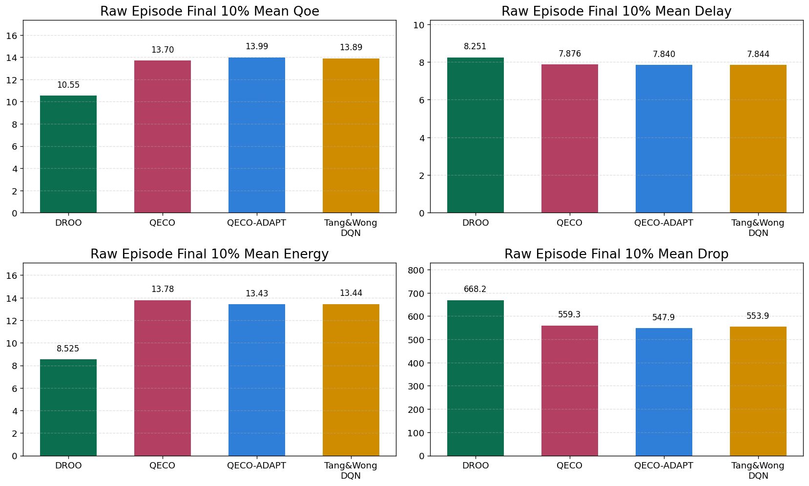
  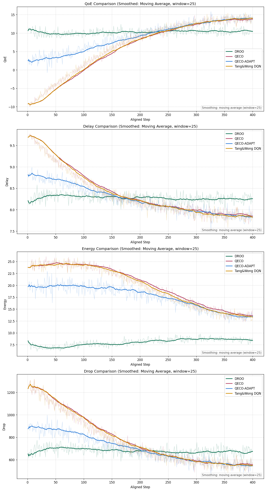

**그림 8. S4 고부하 단일 edge 환경의 비교 그래프.** 왼쪽은 final 10% 평균 지표, 오른쪽은 episode 기반 smoothed time-series이다.

#### S5: `user=50`, `edge=10`

  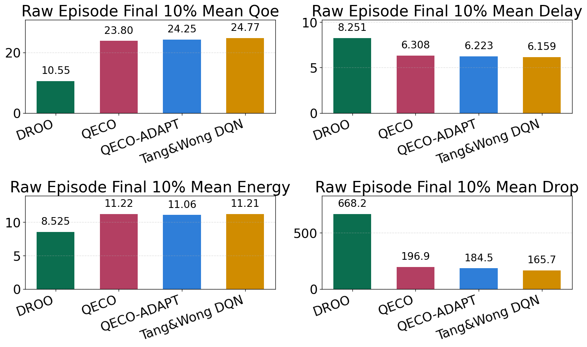
  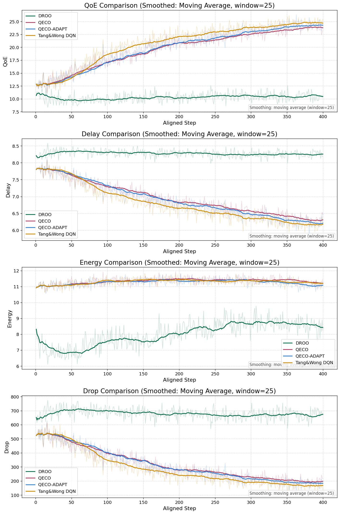

**그림 9. S5 고부하 다중 edge 환경의 비교 그래프.** 왼쪽은 final 10% 평균 지표, 오른쪽은 episode 기반 smoothed time-series이다.

#### S6: `user=80`, `edge=1`

  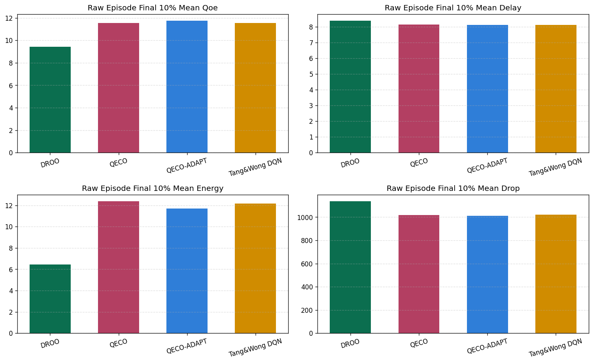
  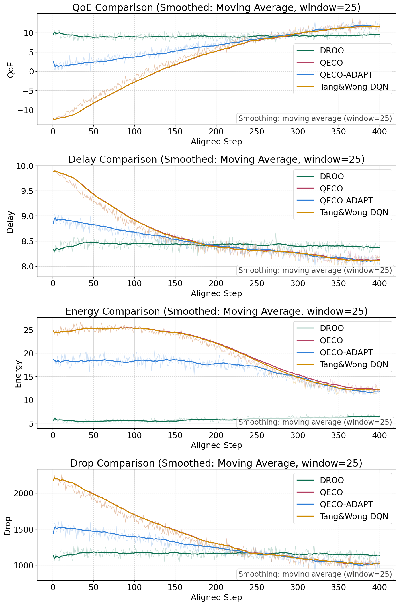

**그림 10. S6 매우 높은 부하 단일 edge 환경의 비교 그래프.** 왼쪽은 final 10% 평균 지표, 오른쪽은 episode 기반 smoothed time-series이다.

#### S7: `user=80`, `edge=3`

  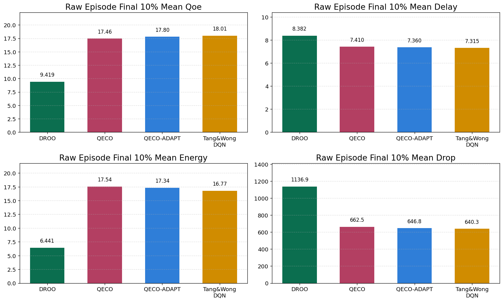
  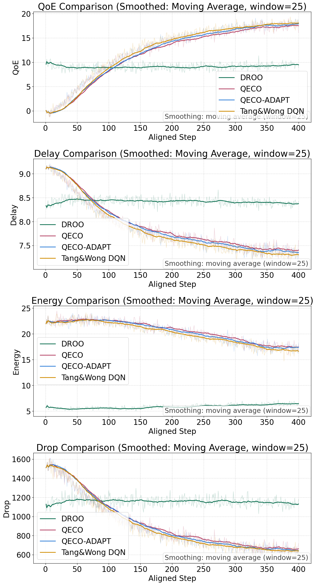

**그림 11. S7 매우 높은 부하 다중 edge 환경의 비교 그래프.** 왼쪽은 final 10% 평균 지표, 오른쪽은 episode 기반 smoothed time-series이다.

모든 run은 현재 공통 환경에서 episode 수를 동일하게 맞추었기 때문에, time-series는 별도의 1000-point interpolation이 아니라 raw episode 기준의 수렴 경향을 보여준다. 따라서 그림 5부터 그림 11까지의 오른쪽 그래프는 QECO-ADAPT가 초기 수렴 구간과 중·고부하 조건에서 어떤 방향으로 변하는지 확인하기 위한 보조 자료로 해석한다.

### 5.3 전체 시나리오 요약
각 시나리오에서 지표별로 가장 두드러진 결과를 요약하면 다음과 같다.

| 시나리오 | QoE 우세 | Delay 우세 | Energy 우세 | Drop 우세 | Runtime 우세 | 해석 |
| --- | --- | --- | --- | --- | --- | --- |
| S1: 10/1 | Tang&Wong-style DQN | QECO | DROO | QECO | DROO | 저부하 환경에선 QECO 계열이 Drop에서 안정적이고, QECO-ADAPT 이득은 제한적 |
| S2: 30/1 | QECO | Tang&Wong-style DQN | DROO | QECO | DROO | 단일 edge 혼잡 구간에서 QECO가 가장 안정적이며 QECO-ADAPT는 QECO와 근접 |
| S3: 30/3 | Tang&Wong-style DQN | Tang&Wong-style DQN | DROO | Tang&Wong-style DQN | DROO | edge 확장 시 QECO 계열 전반 성능이 크게 회복 |
| S4: 50/1 | QECO-ADAPT | QECO-ADAPT | DROO | QECO-ADAPT | QECO | 중간 고부하 단일 edge에서 QECO-ADAPT가 QECO보다 의미 있는 개선 |
| S5: 50/10 | Tang&Wong-style DQN | Tang&Wong-style DQN | DROO | Tang&Wong-style DQN | Tang&Wong-style DQN | edge가 충분하면 Tang&Wong-style DQN과 QECO-ADAPT가 모두 강해짐 |
| S6: 80/1 | QECO-ADAPT | QECO-ADAPT | DROO | QECO-ADAPT | DROO | 매우 높은 user 수에서 QECO-ADAPT가 QECO 대비 상대적 이득 확보 |
| S7: 80/3 | Tang&Wong-style DQN | Tang&Wong-style DQN | DROO | Tang&Wong-style DQN | DROO | 고부하 다중 edge에선 Tang&Wong-style DQN이 가장 강한 성능을 보임 |

## 6. QECO 대비 QECO-ADAPT의 변화량
다음 표는 QECO-ADAPT가 QECO 대비 얼마나 달라졌는지를 마지막 10% 평균 기준으로 정리한 것이다. `QoE`는 양수일수록 좋고, `Delay`, `Energy`, `Drop`, `Runtime`은 음수일수록 좋다.

| 시나리오 | ΔQoE | ΔDelay | ΔEnergy | ΔDrop | ΔRuntime | 해석 |
| --- | ---: | ---: | ---: | ---: | ---: | --- |
| S1: 10/1 | -1.7895 | +0.3271 | -0.9622 | +10.9500 | +0.0796 | 저부하 단일 edge에서는 QECO-ADAPT가 과도하게 보수적 |
| S2: 30/1 | -0.0709 | -0.0129 | -0.3169 | +4.8500 | -0.1366 | QECO와 거의 동일하나 Drop은 소폭 악화 |
| S3: 30/3 | +0.2073 | -0.0206 | +0.1070 | -4.1750 | +0.0087 | edge 확장 시 QECO-ADAPT가 QoE·Drop에서 개선 가능 |
| S4: 50/1 | +0.2907 | -0.0367 | -0.3488 | -11.3750 | +0.7119 | 중간 고부하에서는 QECO-ADAPT의 개선 효과가 뚜렷 |
| S5: 50/10 | +0.4442 | -0.0852 | -0.1561 | -12.4250 | +0.6166 | edge 수가 많을수록 QECO-ADAPT의 균형 개선이 뚜렷 |
| S6: 80/1 | +0.2094 | -0.0344 | -0.6711 | -6.6750 | +1.0311 | 매우 높은 user 수에서도 QECO 대비 에너지 이점 유지 |
| S7: 80/3 | +0.3381 | -0.0507 | -0.2006 | -15.6750 | -0.0277 | 고부하 다중 edge 환경에서 QECO-ADAPT가 가장 안정적으로 작동 |

이 표는 현재 QECO-ADAPT의 성격을 명확히 보여준다. 저부하 환경(S1)에서는 불리하지만, 그 외 대부분의 중간 이상 부하 환경에서는 QECO 대비 Energy와 Drop을 동시에 줄이거나, QoE와 Delay를 보존하면서 약간 개선하는 방향으로 작동한다.

## 7. 논의
### 7.1 DROO의 위치
DROO는 모든 시나리오에서 Energy 절감 측면의 강점을 일관되게 유지한다. 그러나 Drop이 항상 가장 크거나 매우 큰 수준으로 남아 있어, deadline 민감 MEC 환경에서 사용자 경험 중심 알고리즘으로 보기는 어렵다. 따라서 DROO는 에너지 효율의 기준선으로는 유용하지만, QoE 및 완료율 중심 정책과는 명확한 trade-off를 가진다.

### 7.2 QECO의 위치
QECO는 대부분의 단일 edge 환경에서 안정적인 기준선 역할을 수행한다. 특히 `user=10, edge=1`과 `user=30, edge=1`에서는 QoE와 Drop의 균형이 가장 자연스럽다. 이는 장기 QoE 최적화와 deadline-aware reward가 저부하 및 중간 부하 환경에 잘 맞기 때문으로 해석할 수 있다.

### 7.3 QECO-ADAPT의 위치
현재 QECO-ADAPT는 모든 환경에서 QECO를 일괄적으로 대체하지는 않는다. 그러나 `user=50` 이상이거나 edge 수가 확장된 환경에서는 QECO보다 더 나은 균형을 보이는 경우가 늘어난다. 즉 QECO-ADAPT의 핵심 가치는 "항상 우월함"이 아니라 "환경 부하와 edge 자원 수준에 따라 더 적절한 보수화 강도를 제공하는 적응성"에 있다.

### 7.4 Tang&Wong-style DQN의 위치
Tang&Wong-style DQN은 특히 다중 edge 시나리오에서 가장 높은 QoE와 가장 낮은 Drop을 달성하는 경우가 많았다. 따라서 현재 실험 결과만 놓고 보면, Tang&Wong-style DQN은 edge 자원이 충분한 고부하 환경의 강력한 비교군이다. 다만 단일 edge 고부하 환경에서는 QECO-ADAPT가 더 나은 QoE와 Drop을 보이는 경우도 있어, Tang&Wong-style DQN의 강점은 단순한 user 수보다 edge 자원 구성에 더 민감하게 나타난다. 또한 energy 측면에서는 DROO에 미치지 못하고, 일부 단일 edge 저부하 환경에서는 QECO와 거의 유사한 수준에 머문다.

### 7.5 Runtime 관찰
runtime은 초기 예상과 달리 항상 DROO가 가장 빠르지는 않았다. 예를 들어 `user=50, edge=1`에서는 QECO가 DROO보다 빠르게 측정되었고, `user=50, edge=10`에서는 Tang&Wong-style DQN이 가장 낮은 runtime을 보였다. 한편 CD는 별도 보조 비교에서 `user=10, edge=1` 환경에서도 `14.3218s`의 trimmed median runtime을 보여, QECO와 QECO-ADAPT의 약 `1.43s` 대비 현저히 느렸다. 따라서 현재 공통 평가 환경에서의 runtime은 단순히 알고리즘 이름보다 사용자 수와 edge 구성, 그리고 최적화 방식의 차이에 크게 영향을 받는다고 해석할 수 있다.

이를 전체 시나리오에 대해 정리하면 다음과 같다. 표의 값은 각 알고리즘의 episode runtime에서 극단값의 영향을 줄인 trimmed median이며, 단위는 초이다.

| 시나리오 | 사용자 수 | edge 수 | DROO | QECO | QECO-ADAPT | Tang&Wong-style DQN | 가장 낮은 runtime |
| --- | ---: | ---: | ---: | ---: | ---: | ---: | --- |
| S1 | 10 | 1 | 1.4322 | 1.5699 | 1.6495 | 1.5264 | DROO |
| S2 | 30 | 1 | 3.5228 | 4.3848 | 4.2482 | 4.3461 | DROO |
| S3 | 30 | 3 | 3.5470 | 3.9403 | 3.9490 | 3.8265 | DROO |
| S4 | 50 | 1 | 8.1153 | 6.4818 | 7.1937 | 6.7177 | QECO |
| S5 | 50 | 10 | 9.4509 | 7.4879 | 8.1046 | 6.4098 | Tang&Wong-style DQN |
| S6 | 80 | 1 | 8.7433 | 9.5163 | 10.5473 | 10.2755 | DROO |
| S7 | 80 | 3 | 8.9307 | 9.6805 | 9.6528 | 9.5089 | DROO |

이 결과는 runtime 관찰이 단일 알고리즘의 절대적 우열보다 환경 조건에 민감하다는 점을 보여준다. 특히 QECO-ADAPT는 일부 고부하 조건에서 QoE, Delay, Drop 개선을 보였지만, runtime은 QECO보다 항상 낮지는 않았다. 따라서 QECO-ADAPT의 장점은 계산 시간 자체의 단축이라기보다, QECO와 같은 실행 시간 범위 안에서 부하 적응형 에너지 제어를 추가한다는 점에 있다.

### 7.6 QECO-ADAPT의 초반 수렴 이점과 MEC적 의미
실험 곡선상에서 QECO-ADAPT는 일부 시나리오에서 QECO보다 초반 수렴 구간이 더 빠르게 안정화되는 경향을 보였다. 이 특성은 MEC 환경에서 단순 학습 속도 이상의 의미를 가진다.

우리 결과만 보더라도 이 해석에는 정량적 근거가 있다. 예를 들어 `user=30, edge=3`, `user=50, edge=1`, `user=80, edge=1`, `user=80, edge=3` 시나리오에서는 QECO-ADAPT가 QECO보다 episode 전체 평균 QoE와 마지막 10% QoE를 동시에 높게 기록했고, Drop 평균도 더 낮았다. 이는 QECO-ADAPT가 단순히 최종 구간만 유리한 것이 아니라, 학습 과정 전반에서 더 이른 시점부터 실용적인 정책 품질에 도달했을 가능성을 시사한다. 다만 현재의 초반 수렴 해석은 별도의 convergence-time metric이 아니라 episode 전체 평균과 final 평균의 동시 개선에서 도출한 간접 해석이므로, 후속 실험에서는 목표 QoE 도달 episode, Drop 안정화 episode와 같은 직접 수렴 지표를 추가할 필요가 있다. 반대로 `user=10, edge=1` 같은 저부하 환경에서는 이러한 이점이 나타나지 않았으므로, 초반 수렴의 장점 역시 환경 의존적으로 해석해야 한다.

첫째, MEC의 오프로딩 결정은 시간에 따라 변하는 채널 상태와 확률적 task arrival 하에서 온라인으로 수행되어야 한다. Bi 등은 Lyapunov-guided DRL 기반 online computation offloading 연구에서 time-varying wireless channels와 stochastic task arrivals를 전제로 하며, 미래 채널과 arrival을 모른 채 frame 단위 결정을 내려야 한다고 설명한다 [4]. 또한 최근의 online dynamic MEC 연구와 partial offloading 연구 역시 task arrival, wireless quality, dynamic channel을 핵심 불확실성으로 전제한다 [5], [7]. 따라서 초기 수렴이 빠르다는 것은 정책이 유효한 의사결정 수준에 더 빨리 도달한다는 뜻이며, 실제 MEC 운용에서는 환경 변화 후 재적응 시간이 짧아지는 이점으로 해석될 수 있다.

둘째, 무선 자원 관리 문제에서 느린 수렴은 실시간 처리에 직접적인 부담이 된다. Sun 등은 반복적 최적화 기법이 많은 convergence iteration을 요구하면 real-time processing에 어려움을 준다고 지적하며, 학습 기반 접근의 장점을 거의 실시간에 가까운 의사결정 가능성으로 설명한다 [3]. 같은 논리를 MEC 오프로딩에 적용하면, QECO-ADAPT의 초반 수렴 이점은 warm-up 구간에서의 불안정한 탐험을 줄이고, 보다 빠르게 실사용 가능한 정책 품질에 도달하게 만든다.

셋째, partial offloading 연구는 binary offloading보다 더 유연한 오프로딩 비율 조절이 가능하다는 장점을 제시하지만, 그만큼 feasible action space와 resource allocation 문제가 복잡해질 수 있다 [7]. 본 연구의 QECO-ADAPT는 partial offloading 자체를 도입하지 않고, QECO의 기존 action structure를 유지한 채 penalty strength만 부하에 따라 조절한다. 따라서 QECO-ADAPT의 장점은 최적화 표현력의 확대보다는 기존 QECO 정책의 계산 구조를 보존하면서 환경 반응성을 추가하는 데 있다.

넷째, QECO 자체도 dynamic and uncertain mobile environment를 다루기 위한 QoE-oriented DRL 알고리즘으로 제안되었다 [2]. 이러한 맥락에서 QECO-ADAPT의 빠른 초기 안정화는 단순한 학습 효율 향상을 넘어, deadline-sensitive MEC 서비스에서 초반 queue 누적과 task drop의 악화를 줄일 수 있는 잠재적 장점으로 연결된다. 본 연구는 아직 이 점을 다중 seed와 적응 시간 지표로 정량화하진 않았으나, 현재 결과는 QECO-ADAPT의 가치를 최종 평균 성능뿐 아니라 초기 수렴 성능 관점에서도 평가할 필요가 있음을 시사한다.

### 7.7 한계와 후속 검증 항목
QECO-ADAPT는 Lyapunov 기반 알고리즘처럼 queue stability를 수학적으로 보장하는 방식은 아니다. 본 연구의 적응형 gating은 부하가 높을수록 energy penalty와 오프로딩 보수화를 강화하는 경험적 제어식이며, 안정성 보장은 실험 결과를 통해 관찰적으로 확인하는 단계에 있다. 따라서 향후에는 queue length, deadline violation episode, 목표 QoE 도달 episode를 별도 지표로 추가해 안정성과 수렴 속도를 직접 검증해야 한다.

또한 현재 `base_profile(t)`와 `user_activity(u)`는 실제 trace 기반 추정값이 아니라 실험 환경의 부하를 표현하기 위한 parameterized profile이다. 실제 MEC 서비스 환경에 적용하려면 시간대별 접속 로그, 사용자별 task 발생 빈도, edge별 혼잡도 기록을 이용해 profile을 추정하고, `load_scale_base`를 서비스 단위로 보정해야 한다. 이 점을 보완하면 QECO-ADAPT는 단순 simulation parameter가 아니라 운영 환경의 관측 부하에 반응하는 online adaptation mechanism으로 확장될 수 있다.

## 8. 결론
본 연구는 DROO, QECO, QECO-ADAPT, Tang&Wong-style DQN을 공통 MEC 환경에서 비교하고, 사용자 수와 edge 수 변화에 따른 성능 경향을 정리하였다. 핵심 결론은 다음과 같다.

- DROO는 에너지 측면에서 가장 강하지만 Drop이 크다.
- QECO는 저부하 단일 edge 환경에서 가장 안정적인 기준선이다.
- QECO-ADAPT는 저부하 환경에서는 이득이 약하지만, 사용자 수 증가 또는 edge 확장 환경에서는 QECO 대비 점진적 개선 가능성을 보인다.
- Tang&Wong-style DQN은 특히 다중 edge 환경에서 가장 강한 QoE와 Drop 성능을 보였다.

따라서 QECO-ADAPT는 단순히 QECO의 대체 모델이 아니라, 환경 의존적 적응형 에너지 제어 메커니즘으로 해석하는 것이 적절하다. 더 나아가 초반 수렴이 빠르게 관찰되는 경향은 동적 MEC 환경에서 재학습 비용과 정책 warm-up 손실을 줄일 수 있는 잠재적 장점으로 볼 수 있다. 향후에는 `load_scale_base` 민감도 분석, `base_profile` 및 `user_activity` 범위 조정, 다중 seed 반복 실험, 그리고 초기 수렴 속도 자체를 비교하는 적응 시간 지표를 추가하여 QECO-ADAPT의 유효 구간을 더 엄밀하게 규정할 필요가 있다.

## 참고문헌
1. L. Huang, S. Bi and Y.-J. Angela Zhang, “Deep Reinforcement Learning for Online Computation Offloading in Wireless Powered Mobile-Edge Computing Networks,” *IEEE Transactions on Mobile Computing*, vol. 19, no. 11, pp. 2581–2593, Nov. 2020, doi: 10.1109/TMC.2019.2928811.

2. I. Rahmaty, H. Shah-Mansouri and A. Movaghar, “QECO: A QoE-Oriented Computation Offloading Algorithm Based on Deep Reinforcement Learning for Mobile Edge Computing,” *IEEE Transactions on Network Science and Engineering*, vol. 12, no. 4, pp. 3118–3130, 2025, doi: 10.1109/TNSE.2025.3556809.

3. H. Sun, X. Chen, Q. Shi, M. Hong, X. Fu, and N. D. Sidiropoulos, “Learning to optimize: Training deep neural networks for wireless resource management,” in *Proc. IEEE 18th Int. Workshop Signal Process. Adv. Wireless Commun. (SPAWC)*, 2017, pp. 1–6, doi: 10.1109/SPAWC.2017.8227766.

4. S. Bi, L. Huang, H. Wang, and Y.-J. A. Zhang, “Lyapunov-Guided Deep Reinforcement Learning for Stable Online Computation Offloading in Mobile-Edge Computing Networks,” *IEEE Transactions on Wireless Communications*, vol. 20, no. 11, pp. 7519–7537, 2021, doi: 10.1109/TWC.2021.3085319.

5. S. Chen and W. Jiang, “Online dynamic multi-user computation offloading and resource allocation for HAP-assisted MEC: an energy efficient approach,” *Journal of Cloud Computing*, vol. 13, article 92, 2024, doi: 10.1186/s13677-024-00645-5.

6. M. Tang and V. W. Wong, “Deep Reinforcement Learning for Task Offloading in Mobile Edge Computing Systems,” *IEEE Transactions on Mobile Computing*, vol. 21, no. 6, pp. 1985–1997, Jun. 2022, doi: 10.1109/TMC.2020.3036871.

7. L. Sun, R. Liang, L. Wan, K. Liu, Z. Ning, and J. Wang, “Online Partial Computation Offloading Optimization in Wireless Powered Mobile Edge Computing Network,” *IEEE Transactions on Cognitive Communications and Networking*, vol. 12, pp. 1481–1495, 2026, doi: 10.1109/TCCN.2025.3612741.
